---
# Please do not edit this file directly; it is auto generated.
# Instead, please edit 01-introduction.md in _episodes_rmd/

title: "Nanopore-based sequencing: introduction"
teaching: 35
exercises: 0
questions:
- "What is nanopore-based sequencing?"
objectives:
- "Understand details of ONT sequencing platforms."
keypoints:
- "ONT produce a range of popular sequencing platforms."
- "This technology is constantly advancing."
source: Rmd

---

### What is this module about?

 - Long-read sequencing with the Oxford Nanopore Technologies (ONT) platform.
 - WHY?
    - recent technology advances have led to a surge in popularly for this platform.
    - Huge scope for really exciting (and low cost) science
    - Concepts and skills learned here are transferable to other sequencing technologies.
 - WHAT?
    - Genome assembly
    - RNA-seq
    - Variant identification (single base & structural)
    - Base modification (e.g., methylation)
    - Metagenomics

### ONT platforms

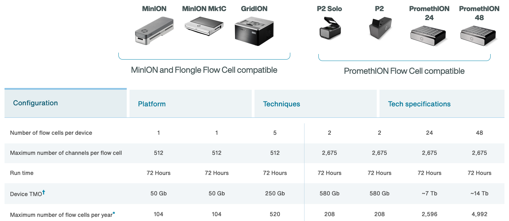

### The MinION

[http://www.nature.com/news/data-from-pocket-sized-genome-sequencer-unveiled-1.14724](http://www.nature.com/news/data-from-pocket-sized-genome-sequencer-unveiled-1.14724)

 - Rough specs (2014)
   - 6-8 hour run time
   - sequence per run: ~110Mbp
   - average read length: 5,400bp
   - reads up to 10kbp
   
 - 2023 specs: 
   - can run for up to 72 hours
   - Maximum (theoretical) yield per run: 50Gbp
   - Maximum read length recorded: >4Mbp

[https://nanoporetech.com](https://nanoporetech.com)
[https://nanoporetech.com/products/specifications](https://nanoporetech.com/products/specifications)

### The MinION Mk1B

 - The MinION Mk1B is the current version of ONT's original sequencer.
 - Connects to a computer via USB.

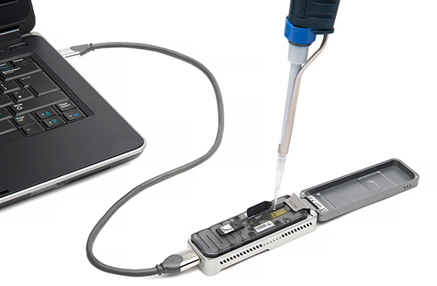

[https://nanoporetech.com/products/minion](https://nanoporetech.com/products/minion)

    

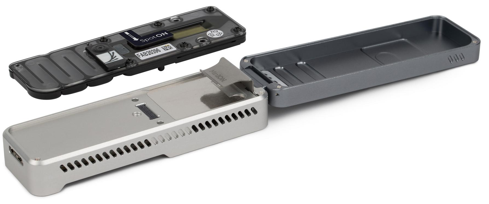

### The MinION Mk1C

 - The MinION Mk1C provides a truly portable sequencing option, with built in compute and touchscreen.
 - For the price, however, the hardware is not particularly impressive.

   
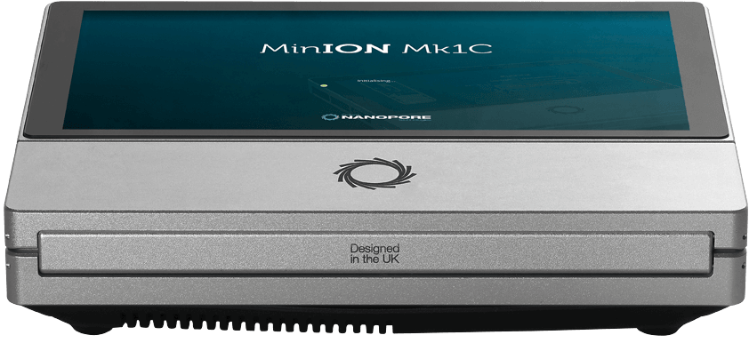

[https://nanoporetech.com/products/minion](https://nanoporetech.com/products/minion)

### The MinION Mk1D

- The next iteration of portable sequencing devices is the Mk1D.
- Tablet-based (plug-in).
- Currently details are limited, but developer versions ~~are~~ were scheduled to be released during 2023: "Further details on specifications will be provided in 2023."

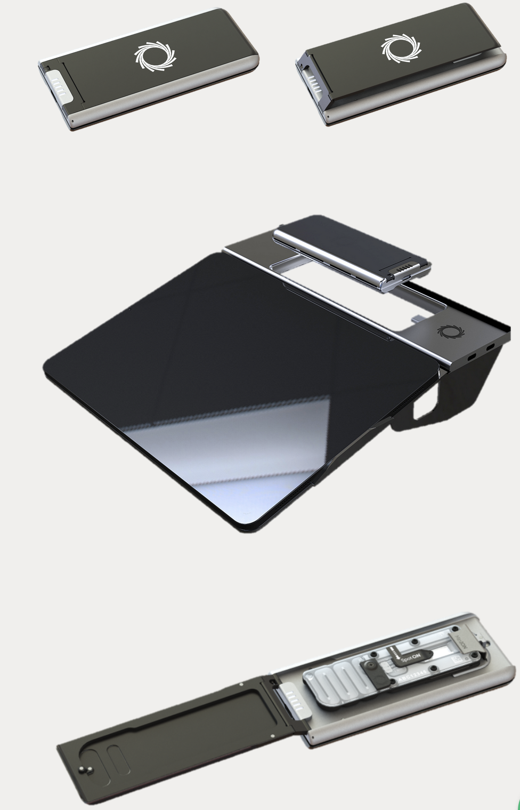

[https://nanoporetech.com/products/minion-mk1d](https://nanoporetech.com/products/minion-mk1d)

### The GridION

 - The GridION offers a "medium-throughput" option for Nanopore-based sequencing: 
 can run up to five flowcells at once.
 - The MinION (Mk1B and Mk1C) and GridION use the same flow cells
 - The Otago Genomics Facility has one of these.

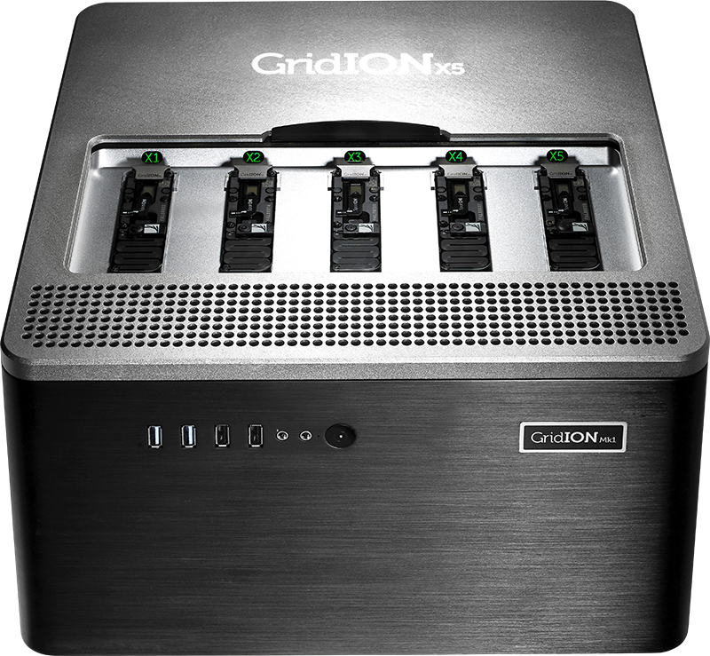

[https://nanoporetech.com/products/gridion](https://nanoporetech.com/products/gridion)

### The Flongle

 - The Flongle uses an adapter to allow a smaller (and cheaper) flow cell to be used in the MinION and GridION devices.
 - Single-use system provides low-cost option for targeted sequencing (e.g., diagnostic applications).

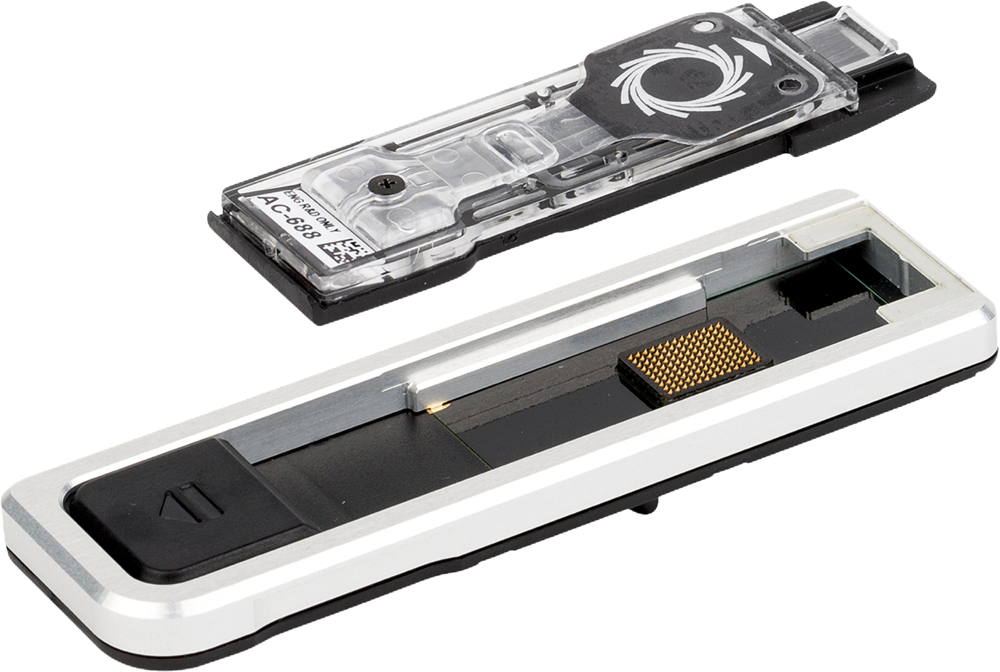

[https://nanoporetech.com/products/flongle](https://nanoporetech.com/products/flongle)

### PromethION

 - The higher throughout PromethION uses a smaller cartridge-like flow cell. Two options: 24 or 48 flow cells.

[https://nanoporetech.com/products/promethion](https://nanoporetech.com/products/promethion)

 

### A "mini-PromethION": the P2

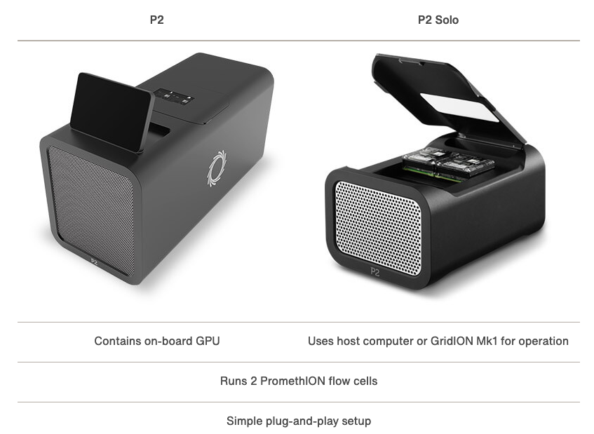

Smaller device (standalone or connect to host computer) that can run Promethion flow cells.

[https://nanoporetech.com/products/p2](https://nanoporetech.com/products/p2)

### Flowcell characteristics

 - Pores are arranged in sets of four to form a “channel”. Periodically during the sequencing run, the ONT software decides which of the four pores to use from each channel (called a “mux scan”).
   - MinION flowcells have 512 channels, so 2048 pores: typically ~1200-1800 are "active" (usable pre-run) (ONT guarantees at least 800 active pores).
   - PromethION flowcells have 2675 channels, so 10,700 pores (ONT guarantees at least 5000 active pores).
 - Sequencing occurs at roughly 450 bases per second (ONT recommends keeping speed above 300 bases per second - additional reagents can be added to "refuel" the flowcell*), although other speeds are now possible (can prioritise data volume vs accuracy).
 - NOTE: pores are not constantly active, and can become blocked during the run 
 
 * [https://community.nanoporetech.com/protocols/experiment-companion-minknow/v/mke_1013_v1_revbm_11apr2016/refuelling-your-flow-cell](https://community.nanoporetech.com/protocols/experiment-companion-minknow/v/mke_1013_v1_revbm_11apr2016/refuelling-your-flow-cell)

### Nanopore technology

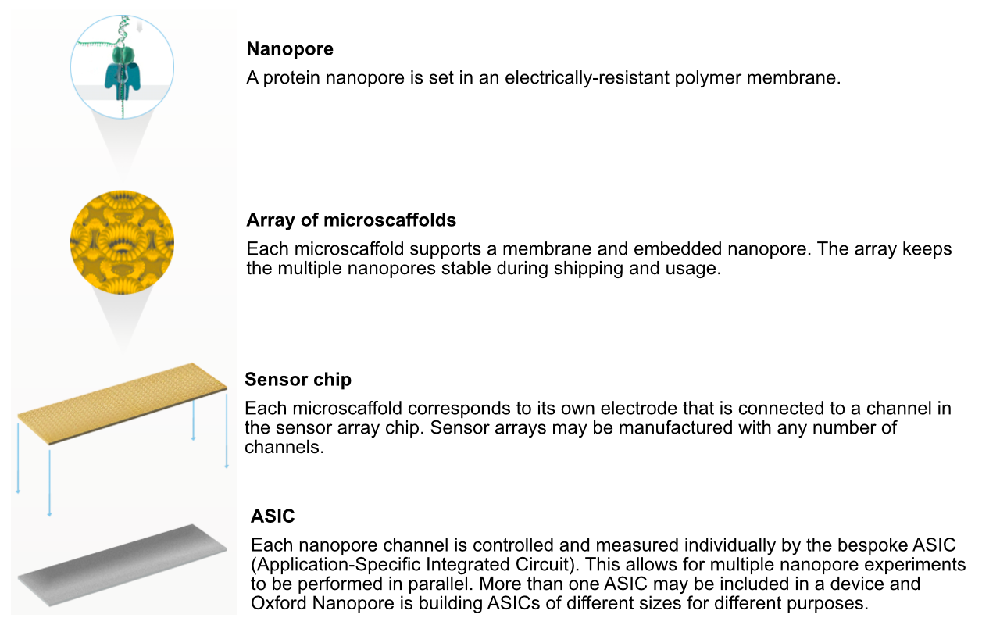

[https://nanoporetech.com/how-it-works](https://nanoporetech.com/how-it-works)

### Nanopore technology

 - A motor protein (green) passes a strand of DNA through a nanopore (blue). The current is changed as the bases G, A, T and C pass through the pore in different combinations.

[https://nanoporetech.com/how-it-works](https://nanoporetech.com/how-it-works)

### Nanopore movies

For more detailed information about ONT sequencing:

 - [https://nanoporetech.com/products/minion](https://nanoporetech.com/products/minion)
 - [https://nanoporetech.com/products/minion](https://nanoporetech.com/how-it-works)

### Technological advances...

 - Since its introduction, nanopore sequencing has seen a number of improvements.
 - The initial product was realtively slow, expensive (per base sequenced) and error prone (i.e., incorrect bases calls).
 - Incremental improvements have led to major advances in both speed and accuracy.

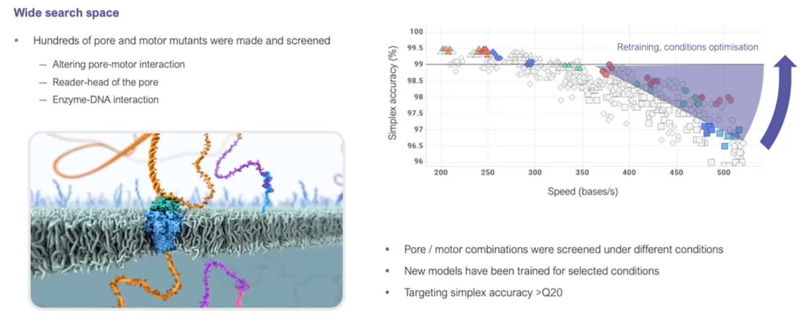

[https://nanoporetech.com/resource-centre/london-calling-2022-update-oxford-nanopore-technologies](https://nanoporetech.com/resource-centre/london-calling-2022-update-oxford-nanopore-technologies)

 
### 2D sequencing (prior to 2017)

 - Hairpin-based approach provided natural error detection methodology:
   - Link DNA strands with a hairpin adapter.
   - Sequence template strand followed by complement.
   - Basecall and compare sequences to produce consensus.

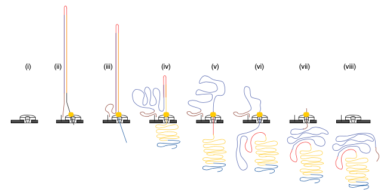

Jain, et al. The Oxford Nanopore MinION: delivery of nanopore sequencing to the genomics community. Genome Biol 17, 239 (2016). 
[https://doi.org/10.1186/s13059-016-1103-0](https://doi.org/10.1186/s13059-016-1103-0)

### What happened to 2D reads?

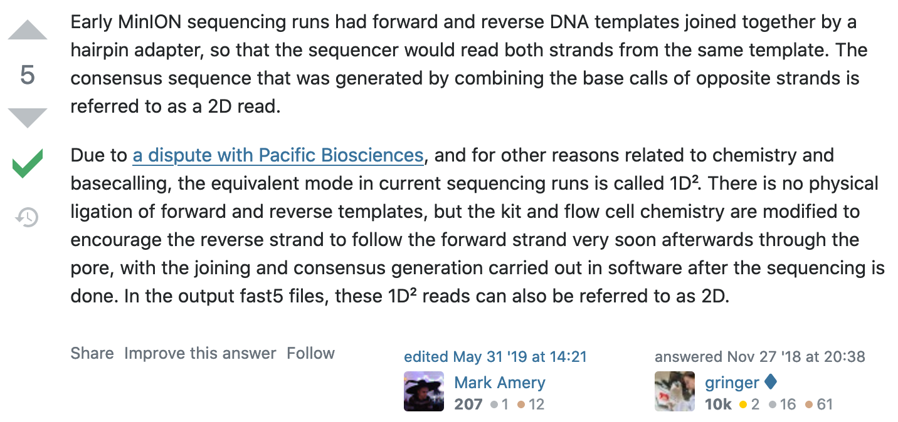

[https://bioinformatics.stackexchange.com/questions/5525/what-are-2d-reads-in-the-oxford-minion/5528](https://bioinformatics.stackexchange.com/questions/5525/what-are-2d-reads-in-the-oxford-minion/5528)

### The hairpin lawsuit...

 - PacBio (competitor in the long-read space) and ONT have filed a number of lawsuits against each other over the past few years.

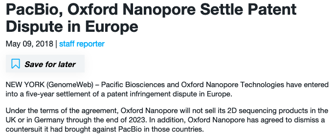

[https://www.genomeweb.com/sequencing/pacbio-oxford-nanopore-settle-patent-dispute-europe](https://www.genomeweb.com/sequencing/pacbio-oxford-nanopore-settle-patent-dispute-europe)

 

### 1D2 sequencing

 - In 2017 ONT announced the new 1D2 chemistry
 - Showed higher accuracy that 1D (and SAID it was better than 2D)
 - It didn't last long... 

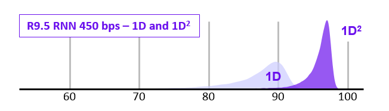

 - Video at link below:

[https://nanoporetech.com/about-us/news/1d-squared-kit-available-store-boost-accuracy-simple-prep](https://nanoporetech.com/about-us/news/1d-squared-kit-available-store-boost-accuracy-simple-prep)

### Pore imporvements: the R10 pore

 - ONT introduced the new R10 pore in 2019 (previous was R9.4.1).
 - Main differences were *longer barrel* and *dual reader head:* gave improved resolution of homopolymer runs.

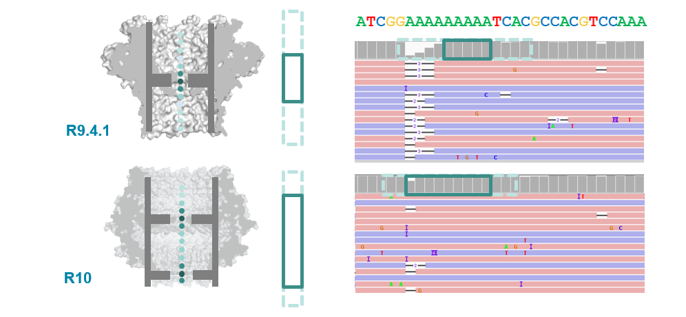

[https://nanoporetech.com/about-us/news/r103-newest-nanopore-high-accuracy-nanopore-sequencing-now-available-store](https://nanoporetech.com/about-us/news/r103-newest-nanopore-high-accuracy-nanopore-sequencing-now-available-store)

### R10.3 vs R9.4.1 performance 

 - With a bit more tweaking (to get to R10.3) ONT improved 1D (i.e., single-strand) sequencing accuracy, although throughput is still not as high as the R.9.4.1 pore.

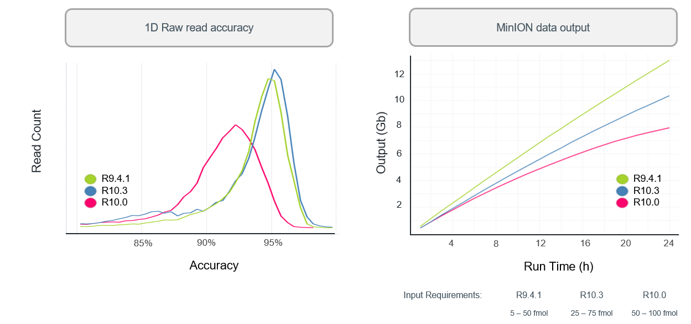

[https://nanoporetech.com/about-us/news/r103-newest-nanopore-high-accuracy-nanopore-sequencing-now-available-store](https://nanoporetech.com/about-us/news/r103-newest-nanopore-high-accuracy-nanopore-sequencing-now-available-store)

### Q20+: the return of 2D reads...

- The previous ONT products are "Q10" (we'll discuss this soon), meaning that the error rate is roughly 1 incorrect base call per 10 bases (that's high!)
- The new "Q20+" products are now available  - moves to less than 1 error per 100 bases (a little more respectable, but still well below short-read technologies like Illumina).
- Upgrade includes a return to the "2D" approach.

 

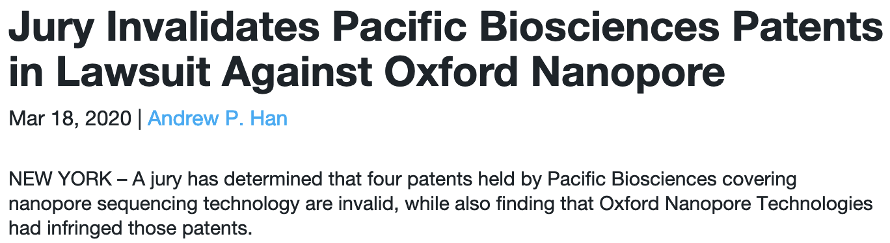

[https://www.genomeweb.com/sequencing/jury-invalidates-pacific-biosciences-patents-lawsuit-against-oxford-nanopore#.YOt8e26xXUI](https://www.genomeweb.com/sequencing/jury-invalidates-pacific-biosciences-patents-lawsuit-against-oxford-nanopore#.YOt8e26xXUI)

### Nanopore workflow

 - ONT provides software (MinKNOW) for operating the MinION, and for generating the sequence data (e.g., the `guppy` and `dorado` basecallers).
 - Once the raw (POD5 or FAST5 - see next section) data have been converted to basecalls, we can use more familiar tools for quality assessment and analysis (e.g., FastQC).

[https://nanoporetech.com/nanopore-sequencing-data-analysis](https://nanoporetech.com/nanopore-sequencing-data-analysis)

### Basecalling: `guppy` (deprecated)

 - `guppy` is a neural network based basecaller.
    - analyses the electrical trace data and predicts base 
    - it is GPU-aware, and can basecall in real time 
    - can also call base modifications (e.g., 5mC, 6mA)
    - high accuracy (HAC) mode (slower) and super-high accuracy (SUP) mode (even slower) can improve basecalls post-sequencing
 - MANY other machine learning basecallers have been proposed.
 - Output is the standard "FASTQ" format for sequence data.
 - `guppy` has now been "retired" by ONT, and replaced with `dorado`.

### Basecalling: `dorado`

 - ONT has recently released a new base caller: `dorado`
 - Optimised for 10.4.1 flowcells (but there are basecalling models for 9.4.1)
 - Designed to support Apple GPUs (M1/M2/M3)
 - Like Guppy, can call base modifications
 - Also has FAST, HAC and SUP modes for basecalling.

### 10.4.1 flowcells + v14 chemistry: accuracy

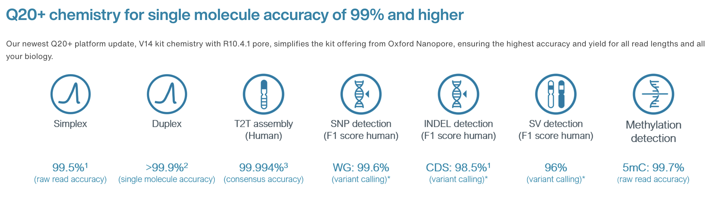

  

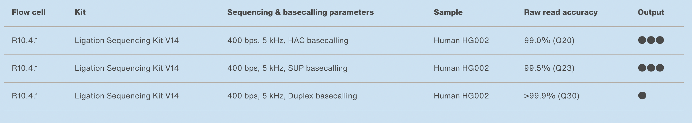

[https://nanoporetech.com/accuracy](https://nanoporetech.com/accuracy)

## 10.4.1 flowcells + v14 chemistry: simplex

- The new chemistry (v14) and updated flowcells (10.4.1) have moved the quality up to ON AVERAGE 1 error per 100 bases (Q20) for simplex reads (single strand).

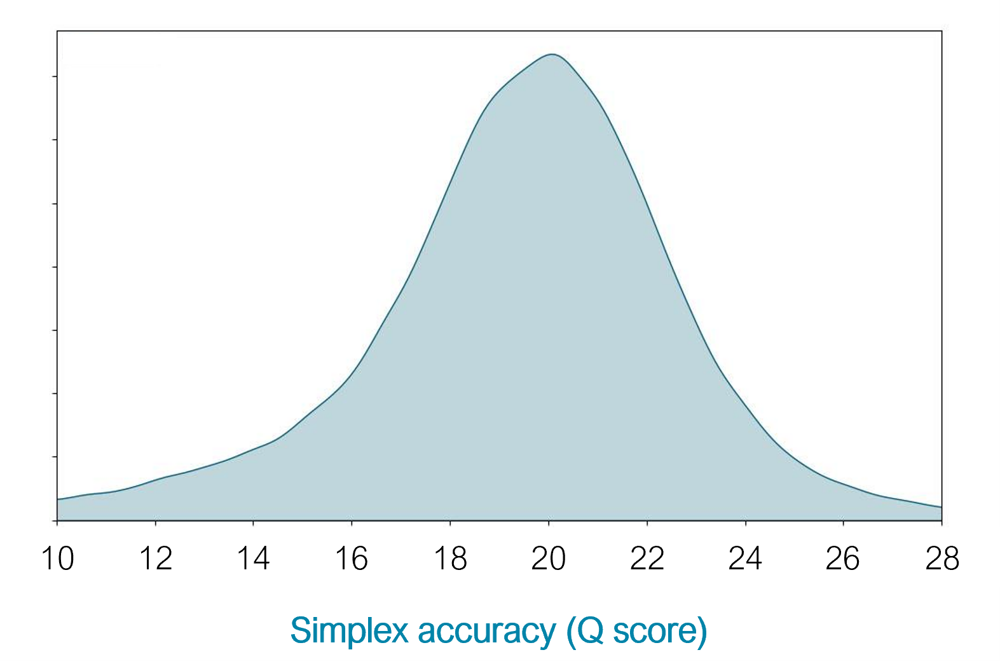

[https://nanoporetech.com/q20plus-chemistry](https://nanoporetech.com/q20plus-chemistry)

### 10.4.1 flowcells + v14 chemistry: duplex

- The quality is even higher for duplex reads: mean of 30
- BUT: less than 50% of reads are duplex (i.e., you don't always manage to read both strands)

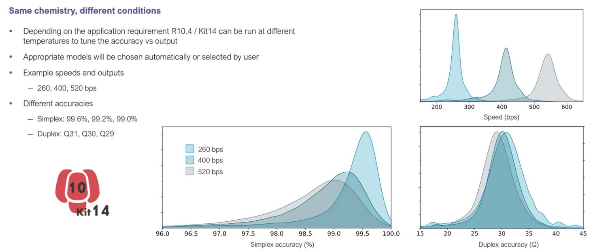

[https://nanoporetech.com/q20plus-chemistry](https://nanoporetech.com/q20plus-chemistry)

### More Nanopore: London Calling 2023

 - Online conference held in May 2023
 - Talk videos available online
 - LOTS of really cool announcements and research applications
 - Can also watch presentations from previous years.

[https://nanoporetech.com/lc23](https://nanoporetech.com/lc23)

