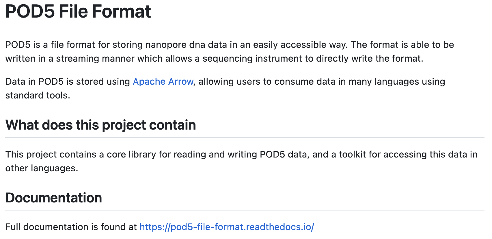

---
# Please do not edit this file directly; it is auto generated.
# Instead, please edit 01-introduction.md in _episodes_rmd/

title: "Nanopore-based sequencing: introduction"
teaching: 20
exercises: 0
questions:
- "What is nanopore-based sequencing?"
objectives:
- "Understand details of ONT sequencing platforms."
keypoints:
- "ONT produce a range of popular sequencing platforms."
- "This technology is constantly advancing."
source: Rmd

---

### What is this module about?

 - Long-read sequencing with the Oxford Nanopore Technologies (ONT) platform.
 - WHY?
    - recent technology advances have led to a surge in popularly for this platform.
    - Huge scope for really exciting (and low cost) science
    - Concepts and skills learned here are transferable to other sequencing technologies.
 - WHAT?
    - Genome assembly
    - RNA-seq
    - Variant identification (single base & structural)
    - Base modification (e.g., methylation)
    - Metagenomics

### ONT platforms

plot of chunk unnamed-chunk-2

### The MinION

[http://www.nature.com/news/data-from-pocket-sized-genome-sequencer-unveiled-1.14724](http://www.nature.com/news/data-from-pocket-sized-genome-sequencer-unveiled-1.14724)

 - Rough specs (2014)
   - 6-8 hour run time
   - sequence per run: ~110Mbp
   - average read length: 5,400bp
   - reads up to 10kbp
   
 - 2023 specs: 
   - can run for up to 72 hours
   - Maximum (theoretical) yield per run: 50Gbp
   - Maximum read length recorded: >4Mbp

plot of chunk unnamed-chunk-3

plot of chunk unnamed-chunk-4

[https://nanoporetech.com](https://nanoporetech.com)
[https://nanoporetech.com/products/specifications](https://nanoporetech.com/products/specifications)

### The MinION Mk1B

 - The MinION Mk1B is the current version of ONT's original sequencer.
 - Connects to a computer via USB.

plot of chunk unnamed-chunk-5

[https://nanoporetech.com/products/minion](https://nanoporetech.com/products/minion)

    

plot of chunk unnamed-chunk-6

### The MinION Mk1C

 - The MinION Mk1C provides a truly portable sequencing option, with built in compute and touchscreen.
 - For the price, however, the hardware is not particularly impressive.

   

plot of chunk unnamed-chunk-7

[https://nanoporetech.com/products/minion](https://nanoporetech.com/products/minion)

plot of chunk unnamed-chunk-8

### The MinION Mk1D

- The next iteration of portable sequencing devices is the Mk1D.
- Tablet-based (plug-in).
- Currently details are limited, but developer versions ~~are~~ were scheduled to be released during 2023: "Further details on specifications will be provided in 2023."

plot of chunk unnamed-chunk-9

[https://nanoporetech.com/products/minion-mk1d](https://nanoporetech.com/products/minion-mk1d)

### The GridION

 - The GridION offers a "medium-throughput" option for Nanopore-based sequencing: 
 can run up to five flowcells at once.
 - The MinION (Mk1B and Mk1C) and GridION use the same flow cells
 - The Otago Genomics Facility has one of these.

plot of chunk unnamed-chunk-10

[https://nanoporetech.com/products/gridion](https://nanoporetech.com/products/gridion)

### The Flongle

 - The Flongle uses an adapter to allow a smaller (and cheaper) flow cell to be used in the MinION and GridION devices.
 - Single-use system provides low-cost option for targeted sequencing (e.g., diagnostic applications).

plot of chunk unnamed-chunk-11

[https://nanoporetech.com/products/flongle](https://nanoporetech.com/products/flongle)

### PromethION

 - The higher throughout PromethION uses a smaller cartridge-like flow cell. Two options: 24 or 48 flow cells.

plot of chunk unnamed-chunk-12

[https://nanoporetech.com/products/promethion](https://nanoporetech.com/products/promethion)

 

plot of chunk unnamed-chunk-13

### A "mini-PromethION": the P2

plot of chunk unnamed-chunk-14

Smaller device (standalone or connect to host computer) that can run Promethion flow cells.

[https://nanoporetech.com/products/p2](https://nanoporetech.com/products/p2)

### Flowcell characteristics

 - Pores are arranged in sets of four to form a “channel”. Periodically during the sequencing run, the ONT software decides which of the four pores to use from each channel (called a “mux scan”).
   - MinION flowcells have 512 channels, so 2048 pores: typically ~1200-1800 are "active" (usable pre-run) (ONT guarantees at least 800 active pores).
   - PromethION flowcells have 2675 channels, so 10,700 pores (ONT guarantees at least 5000 active pores).
 - Sequencing occurs at roughly 450 bases per second (ONT recommends keeping speed above 300 bases per second - additional reagents can be added to "refuel" the flowcell*), although other speeds are now possible (can prioritise data volume vs accuracy).
 - NOTE: pores are not constantly active, and can become blocked during the run 
 
 * [https://community.nanoporetech.com/protocols/experiment-companion-minknow/v/mke_1013_v1_revbm_11apr2016/refuelling-your-flow-cell](https://community.nanoporetech.com/protocols/experiment-companion-minknow/v/mke_1013_v1_revbm_11apr2016/refuelling-your-flow-cell)

### Nanopore technology

plot of chunk unnamed-chunk-15

[https://nanoporetech.com/how-it-works](https://nanoporetech.com/how-it-works)

### Nanopore technology

 - A motor protein (green) passes a strand of DNA through a nanopore (blue). The current is changed as the bases G, A, T and C pass through the pore in different combinations.

plot of chunk unnamed-chunk-16

[https://nanoporetech.com/how-it-works](https://nanoporetech.com/how-it-works)

### Nanopore movies

For more detailed information about ONT sequencing:

 - [https://nanoporetech.com/products/minion](https://nanoporetech.com/products/minion)
 - [https://nanoporetech.com/products/minion](https://nanoporetech.com/how-it-works)

### Technological advances...

 - Since its introduction, nanopore sequencing has seen a number of improvements.
 - The initial product was realtively slow, expensive (per base sequenced) and error prone (i.e., incorrect bases calls).
 - Incremental improvements have led to major advances in both speed and accuracy.

plot of chunk unnamed-chunk-17

[https://nanoporetech.com/resource-centre/london-calling-2022-update-oxford-nanopore-technologies](https://nanoporetech.com/resource-centre/london-calling-2022-update-oxford-nanopore-technologies)

 
### 2D sequencing (prior to 2017)

 - Hairpin-based approach provided natural error detection methodology:
   - Link DNA strands with a hairpin adapter.
   - Sequence template strand followed by complement.
   - Basecall and compare sequences to produce consensus.

plot of chunk unnamed-chunk-18

Jain, et al. The Oxford Nanopore MinION: delivery of nanopore sequencing to the genomics community. Genome Biol 17, 239 (2016). 
[https://doi.org/10.1186/s13059-016-1103-0](https://doi.org/10.1186/s13059-016-1103-0)

### What happened to 2D reads?

plot of chunk unnamed-chunk-19

[https://bioinformatics.stackexchange.com/questions/5525/what-are-2d-reads-in-the-oxford-minion/5528](https://bioinformatics.stackexchange.com/questions/5525/what-are-2d-reads-in-the-oxford-minion/5528)

### The hairpin lawsuit...

 - PacBio (competitor in the long-read space) and ONT have filed a number of lawsuits against each other over the past few years.

plot of chunk unnamed-chunk-20

[https://www.genomeweb.com/sequencing/pacbio-oxford-nanopore-settle-patent-dispute-europe](https://www.genomeweb.com/sequencing/pacbio-oxford-nanopore-settle-patent-dispute-europe)

 

### 1D$^2$ sequencing

 - In 2017 ONT announced the new 1D$^2$ chemistry
 - Showed higher accuracy that 1D (and SAID it was better than 2D)
 - It didn't last long... 

plot of chunk unnamed-chunk-21

 - Video at link below:

[https://nanoporetech.com/about-us/news/1d-squared-kit-available-store-boost-accuracy-simple-prep](https://nanoporetech.com/about-us/news/1d-squared-kit-available-store-boost-accuracy-simple-prep)

### Pore imporvements: the R10 pore

 - ONT introduced the new R10 pore in 2019 (previous was R9.4.1).
 - Main differences were *longer barrel* and *dual reader head:* gave improved resolution of homopolymer runs.

plot of chunk unnamed-chunk-22

[https://nanoporetech.com/about-us/news/r103-newest-nanopore-high-accuracy-nanopore-sequencing-now-available-store](https://nanoporetech.com/about-us/news/r103-newest-nanopore-high-accuracy-nanopore-sequencing-now-available-store)

### R10.3 vs R9.4.1 performance 

 - With a bit more tweaking (to get to R10.3) ONT improved 1D (i.e., single-strand) sequencing accuracy, although throughput is still not as high as the R.9.4.1 pore.

plot of chunk unnamed-chunk-23

[https://nanoporetech.com/about-us/news/r103-newest-nanopore-high-accuracy-nanopore-sequencing-now-available-store](https://nanoporetech.com/about-us/news/r103-newest-nanopore-high-accuracy-nanopore-sequencing-now-available-store)

### Q20+: the return of 2D reads...

- The previous ONT products are "Q10" (we'll discuss this soon), meaning that the error rate is roughly 1 incorrect base call per 10 bases (that's high!)
- The new "Q20+" products are now available  - moves to less than 1 error per 100 bases (a little more respectable, but still well below short-read technologies like Illumina).
- Upgrade includes a return to the "2D" approach.

plot of chunk unnamed-chunk-24

[https://www.genomeweb.com/sequencing/jury-invalidates-pacific-biosciences-patents-lawsuit-against-oxford-nanopore#.YOt8e26xXUI](https://www.genomeweb.com/sequencing/jury-invalidates-pacific-biosciences-patents-lawsuit-against-oxford-nanopore#.YOt8e26xXUI)

### FAST5 / HDF5 data

 - Each pore produces a HUGE amount of data - very roughly, 1Gbp of sequence data requires 1GB of storage (e.g., as gzipped fastq), but to generate 1Gbp of sequence requires 10GB of electrical trace data, so potentially up to 500GB of files for a 72 hour MinION run.
 - (Until recently) the electrical trace data was saved as “.fast5”, which utilises the HDF5 file format:

“Hierarchical Data Format (HDF) is a set of file formats (HDF4, HDF5) designed to store and organize large amounts of data. Originally developed at the National Center for Supercomputing Applications, it is supported by The HDF Group, a non-profit corporation whose mission is to ensure continued development of HDF5 technologies and the continued accessibility of data stored in HDF.”

[https://www.neonscience.org/resources/learning-hub/tutorials/about-hdf5](https://www.neonscience.org/resources/learning-hub/tutorials/about-hdf5)
 
### POD5 format

 - Over the past year (or so) ONT have introduced the POD5 format for storing data.
 - This is a more efficient file format (e.g., faster read and write, smaller) than FAST5.
 - New ONT tools (e.g., the dorado basecaller) can process POD5 data.
 - ONT offers tools (online and Python-based) for converting between FAST5 and POD5:

plot of chunk unnamed-chunk-25

[https://pod5.nanoporetech.com/](https://pod5.nanoporetech.com/)

## Nanopore workflow

 - ONT provides software (MinKNOW) for operating the MinION, and for generating the sequence data (e.g., the `guppy` and `dorado` basecallers).
 - Once the raw FAST5 (or POD5) data have been converted to basecalls, we can use more familiar tools for quality assessment and analysis (e.g., FastQC).

 

### https://nanoporetech.com/nanopore-sequencing-data-analysis

### Basecalling: `guppy`

 - `guppy` is a neural network based basecaller.
    - analyses the electrical trace data and predicts base 
    - it is GPU-aware, and can basecall in real time 
    - can also call base modifications (e.g., 5mC, 6mA)
    - high accuracy (HAC) mode (slower) and super-high accuracy (SUP) mode (even slower) can improve basecalls post-sequencing
 - MANY other machine learning basecallers have been proposed.
 - Output is the standard "FASTQ" format for sequence data.
 - `guppy` has now been "retired" by ONT, and replaced with `dorado`.

### Basecalling: `dorado`

 - ONT has recently released a new base caller: `dorado`
 - Optimised for 10.4.1 flowcells (but there are basecalling models for 9.4.1)
 - Designed to support Apple GPUs (M1/M2/M3)
 - Like Guppy, can call base modifications
 - Also has FAST, HAC and SUP modes for basecalling.

### 10.4.1 flowcells + v14 chemistry: accuracy

plot of chunk unnamed-chunk-26

  

plot of chunk unnamed-chunk-27

[https://nanoporetech.com/accuracy](https://nanoporetech.com/accuracy)

## 10.4.1 flowcells + v14 chemistry: simplex

- The new chemistry (v14) and updated flowcells (10.4.1) have moved the quality up to ON AVERAGE 1 error per 100 bases (Q20) for simplex reads (single strand).

plot of chunk unnamed-chunk-28

[https://nanoporetech.com/q20plus-chemistry](https://nanoporetech.com/q20plus-chemistry)

### 10.4.1 flowcells + v14 chemistry: duplex

- The quality is even higher for duplex reads: mean of 30
- BUT: less than 50% of reads are duplex (i.e., you don't always manage to read both strands)

plot of chunk unnamed-chunk-29

[https://nanoporetech.com/q20plus-chemistry](https://nanoporetech.com/q20plus-chemistry)

### More Nanopore: London Calling 2023

a figure caption

 - Online conference held in May 2023
 - Talk videos available online
 - LOTS of really cool announcements and research applications
 - Can also watch presentations from previous years.

[https://nanoporetech.com/lc23](https://nanoporetech.com/lc23)

