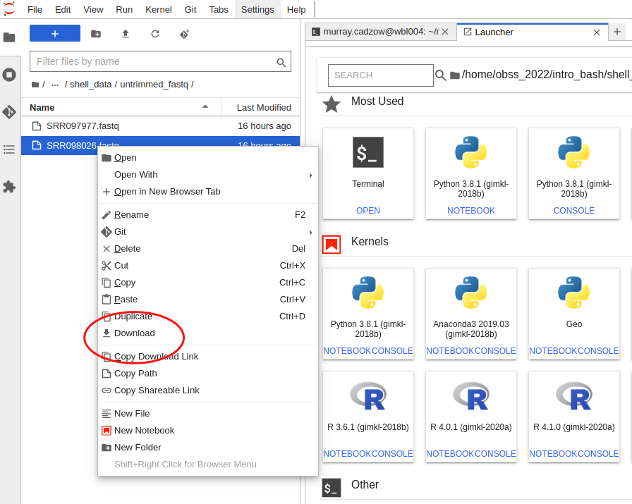
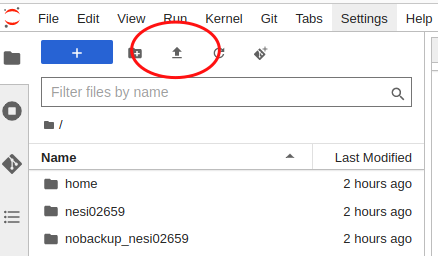

---
# Please do not edit this file directly; it is auto generated.
# Instead, please edit 02-data-transfer.md in _episodes_rmd/

title: "Data Transfer"
teaching: 10
exercises: 10
questions:
- "How do I get data to and from NeSI?"
objectives:
- "Understand how to transfer data with Globus."
- "Understand how to transfer data with `scp`."
- "Understand how to transfer data within JupyterHub."
keypoints:
- "There are multiple methods to transfer data to and from NeSI."
- "The method of choice depends on the size of the data."
source: Rmd

---

Up until now all the data that we have used for the Otago Bioinformatics Spring School has been either already on NeSI or able to be downladed there from the internet. 
With bioinformatics workflows we usually start with needing to get our data from our computer to the computers being used for processing and analysis and then once that is done, we need to transfer it back.

There are three main ways to go about transferring data between your computer and NeSI. These are using `scp` on the commandline, through the upload/download option when running a Jupyter notebook session on NeSI, or through Globus.

Both `scp` and Jupyter methods are only really suitable for small data transfers (< 1 GB). For anything larger, it is recommended to use Globus.

### Generating FASTQ data - basecalling

During the ONT sequencing run, the data generated on the flowcell are stored in FAST5 format. In order to perform further analysis, the FAST5 data 
needs to be converted to FASTQ (the de facto standard for storing sequence and associated base-level quality information).  

Basecalling usually occurs while a sequencing run is underway, but there are some specific situations that will require you to "re-basecall" your data:

1. You didn't perform any basecalling while sequencing - e.g., a MinION being run from a computer without a GPU (so real-time basecalling not possible)

2. You performed basecalling in FAST mode while sequencing, and now you would like to "re-basecall" using a more accurate model (e.g., super-high accuracy mode: SUP)

You may also have downloaded some FAST5 data (i.e., without basecalls), or have access to some older FAST5 data, and you would like re-basecall using a more recent version of ONT's software.

In all of these cases, we need to get the FAST5 data onto a compute system where you have access to a GPU.

Today we will use NeSI for this. 

The first step in the process is to transfer the FAST5 data to NeSI.

## `scp`

From a terminal, `scp` can be used to transfer files to a remote computer.

The documentation for how to use `scp` specifically with NeSI can be found at [https://support.nesi.org.nz/hc/en-gb/articles/360000578455-File-Transfer-with-SCP](https://support.nesi.org.nz/hc/en-gb/articles/360000578455-File-Transfer-with-SCP). There are some configuration steps that need to be done to make this a bit easier.

The general format is `scp <local file to transfer> mahuika:<path to copy file to>` to send a file to NeSI, and `scp mahuika:<path to file> <local path to copy to>` to copy a file from NeSI to your machine.

## Jupyter

Jupyter can be used to both upload and download data, however similar to `scp` it's not ideal for sending large quantities of data.

### Downloading data

To download a file using Jupyter, you will need to use the explorer panel and navigate to the file there. Then, right-click on th file and a menu will pop up. Select "Download" from this menu and your browser will start downloading it.

### Uploading data

Similar to downloading through Juptyer, you first need to use the explorer panel to navigate to the directory where you would like the file to be uploaded to. From there click the upload button in the top left corner and select the file you wish to upload from your computer.

## Globus

The documentation for using globus with NeSI is found at [https://support.nesi.org.nz/hc/en-gb/articles/4405623380751-Data-Transfer-using-Globus-V5](https://support.nesi.org.nz/hc/en-gb/articles/4405623380751-Data-Transfer-using-Globus-V5).

Globus is specialised software that can handle the transfer of large amounts of data between two 'endpoints'. As part of the transfer it can automatically perform the file integrity checks to ensure the file was correctly transferred.

NeSI provides an endpoint, and you need to provide the second - this might be the globus software running on a different server, or the globus software running on your computer.
