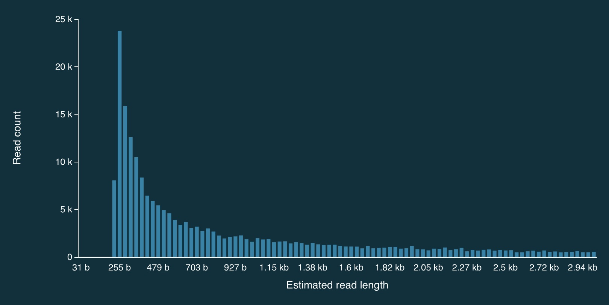
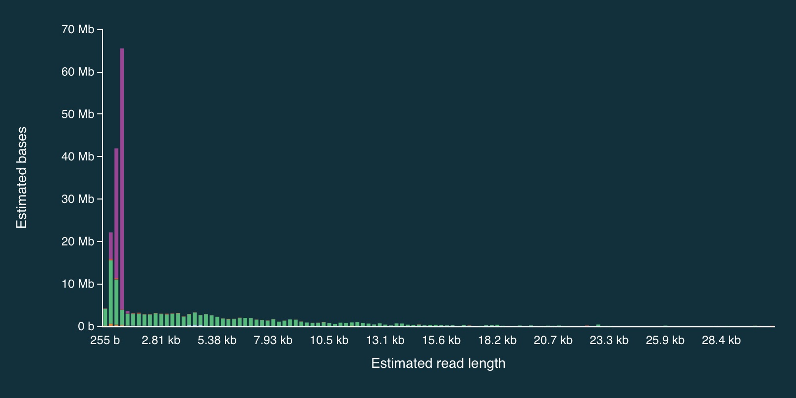
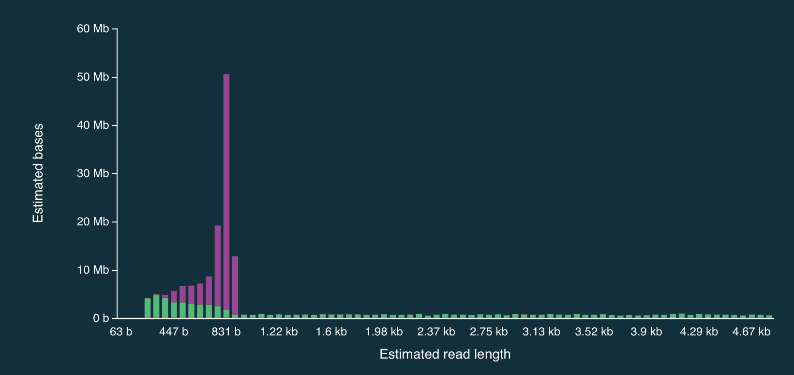
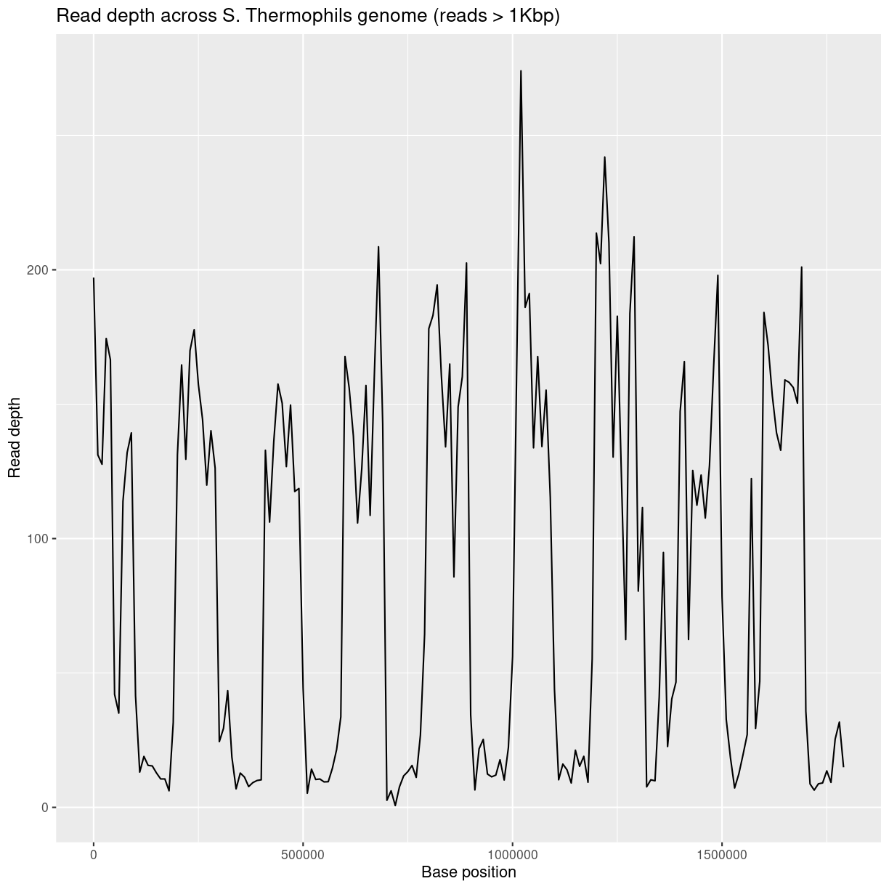

---
# Please do not edit this file directly; it is auto generated.
# Instead, please edit 06-adaptive-sampling.md in _episodes_rmd/
title: "Nanopore - Adaptive Sampling"
teaching: 10
exercises: 10
questions:
- "How can nanopore be used for sequencing only what I want?"
objectives:
- "Explain how adaptive sampling works"
keypoints:
- "Nanopore can determine if it should continue to sequence a read."
source: Rmd
---


## Let's learn about Adaptive Sampling...

Mik will now talk at you.  :)


## Now let's take a look at some data

The folder `adaptive-sampling` (inside the `nanopore` directory) contains data from a **SIMULATED** adaptive sampling run using David Eccles' yoghurt data:

[https://zenodo.org/record/2548026#.YLifQOuxXOQ](https://zenodo.org/record/2548026#.YLifQOuxXOQ)


### What did I do?

The bulk fast5 file was used to simulate a MinION run.  Instead of just playing through the run file which would essentially 
just regenerate the exact same data that the run produced initially), I used MinKNOW's built-in adaptive sampling functionality.

1. Specified *S. thermophilus* as the target genome (1.8Mbp).

2. Provided a bed file that listed 100Kbp regions, interspersed with 100Kbp gaps:

~~~
NZ_LS974444.1   0       99999
NZ_LS974444.1   200000  299999
NZ_LS974444.1   400001  500000
NZ_LS974444.1   600000  699999
NZ_LS974444.1   800000  899999
NZ_LS974444.1   1000000 1099999
NZ_LS974444.1   1200000 1299999
NZ_LS974444.1   1400000 1499999
NZ_LS974444.1   1600000 1699999
~~~

Note that NZ_LS974444.1 is the name of the single chromosome in the fasta file.

Also note that the bed format starts counting at 0 (i.e., the first base of a chromosome is considered "base 0").

3. Specified that we wanted to *enrich* for these regions.

Some caveats:

1. We are *pretending* to do an adaptive sampling run, using data generated from a real 
(non-AS) run, so when a pore is unblocked (i.e., a read mapping to a region that we *don't* 
want to enrich for) in our simulation, we stop accumulating data for that read, but the pore 
doesn't then become available for sequencing another read (because in the REAL run, the 
pore continued to sequence that read).

2. This sample had a LOT of short sequences, so in many cases, the read had been fully sequenced before 
the software had a chance to map it to the genome and determine whether or not to continue sequencing. 

### Distribution of read lengths

Here is the full distribution of read lengths without adaptive sampling turned on (i.e., I also ran a 
simulation without adaptive sampling) - there are LOTS of reads that less than 1000bp long:


Here is a zoomed in view:



### Adaptive sampling results

Despite the caveats, it is fairly clear that the adaptive sampling algorithm worked (or at least that 
it did *something*).  In the plots below, the green bars represent reads that were *not* unblocked (i.e., 
the AS algorithm either: (1) decided the read mapped to a region in our bed file and continued sequencing 
it until the end, or (2) completed sequenced before a decision had been made), while the purple bars represent 
reads that were unblocked (i.e., the read was mapped in real-time, and the AS algorithm decided that it 
*did not* come from a region in our bed file, so ejected the read from the pore).

Here is the full distribution:



And here is a close up:



It is clear from the plots that the length of reads receiving an "unblock" signal is around 800bp, reflecting the time that 
the AS algorithm takes to make a decision about whether or not to reject a read.

### Adaptive sampling details

**NOTE: the information below may now be out of date...**

When adaptive sampling is enabled, an additional output file is created, providing information about every read that was processed.  
It is stored in the `other_reports` folder within the run directory, and is in CSV format.  The naming convention is:

```
adaptive_sampling_XXX_YYY.csv
```

where XXC and YYY are flowcell and run identifiers (I think). 

The format is:

~~~
batch_time,read_number,channel,num_samples,read_id,sequence_length,decision
1669157044.6601431,499,3,4008,bc65b9b4-bc05-45c4-a7b3-4c199577c8c9,350,unblock
1669157045.2247138,301,131,4000,1892041e-71a5-4121-9547-49122e247172,258,unblock
1669157045.2247138,438,42,4002,6be52363-5315-445c-bcd4-3d3b32a829dc,312,stop_receiving
1669157045.2247138,590,76,4001,e459305c-288d-47e7-9bbd-93224ee45074,264,unblock
1669157045.2247138,280,95,4005,a15f9aef-9b60-4f8f-bb74-c96b6f4fa16f,360,stop_receiving
1669157045.2247138,598,94,4001,8f615191-d1d4-42c5-a778-92c91411979b,357,unblock
1669157045.2247138,554,125,4003,8e628f9d-ae37-499e-b32e-7842bcf1539f,364,stop_receiving
1669157045.2247138,431,110,4003,12516158-8ed0-4bf2-bdff-f94171593996,378,unblock
1669157045.2247138,414,102,4008,1cad751a-ddde-4700-bb06-9dcf8974185a,313,unblock
~~~

Or slightly nicer (commas exchanged for tabs):

~~~
batch_time      read_number     channel num_samples          read_id        sequence_length     decision
1669157044.6601431      499     3       4008    bc65b9b4-bc05-45c4-a7b3-4c199577c8c9    350     unblock
1669157045.2247138      301     131     4000    1892041e-71a5-4121-9547-49122e247172    258     unblock
1669157045.2247138      438     42      4002    6be52363-5315-445c-bcd4-3d3b32a829dc    312     stop_receiving
1669157045.2247138      590     76      4001    e459305c-288d-47e7-9bbd-93224ee45074    264     unblock
1669157045.2247138      280     95      4005    a15f9aef-9b60-4f8f-bb74-c96b6f4fa16f    360     stop_receiving
1669157045.2247138      598     94      4001    8f615191-d1d4-42c5-a778-92c91411979b    357     unblock
1669157045.2247138      554     125     4003    8e628f9d-ae37-499e-b32e-7842bcf1539f    364     stop_receiving
1669157045.2247138      431     110     4003    12516158-8ed0-4bf2-bdff-f94171593996    378     unblock
1669157045.2247138      414     102     4008    1cad751a-ddde-4700-bb06-9dcf8974185a    313     unblock
~~~

## Processing adaptive sampling data

Once the data have been generated, they are processed in exactly the same way:

1. Basecalling with `dorado`
2. QA/QC with FastQC and/or NanoPlot
3. Alignment with `minimap2` (via `dorado`)

I've done the above, and a bam file (wih an annoyingly long name) can be found at:

~~~
bam-files/yog-as-100kb-chunks-bed-SUP-pass-aligned-sort.bam
~~~

There are also a few additional things we can do to check how well the adaptive sampling has worked.

### Filtering for read length

Because there are so many short reads (i.e., < 1000 bases) it is actually quite difficult to see the effect of 
adaptive sampling in this data set. To overcome this, we can remove these short reads from the data.

To do this, we can use SAMtools to filter the bam file.


First, load the SAMtools module:

~~~
module load SAMtools
~~~
{: .bash}

Then filter:

~~~
samtools view -h bam-files/yog-as-100kb-chunks-bed-SUP-pass-aligned-sort.bam | \
   awk 'length($10) > 1000 || $1 ~ /^@/' | \
   samtools view -bS - > bam-files/yog-as-100kb-chunks-bed-SUP-pass-aligned-sort-LONG-1KB.bam
~~~
{: .bash}

And then index the new file:

~~~
samtools index bam-files/yog-as-100kb-chunks-bed-SUP-pass-aligned-sort-LONG-1KB.bam
~~~
{: .bash}

Now we have a new bam file that only contains aligned reads longer than 1000bp.


### Checking the read depth of the selected regions

We can use `samtools bedcov` to calculate how much sequence data was generated for specific regions of the genome.

For this, we need a bed file.  This one breaks the 1.8Mbp *S. thermophilus* genome into 100Kbp chunks (admitedly, I missed
a little bit of the end - after 1,800,000bp):

~~~
NZ_LS974444.1   0       99999
NZ_LS974444.1   100000  199999
NZ_LS974444.1   200000  299999
NZ_LS974444.1   300000  399999
NZ_LS974444.1   400000  499999
NZ_LS974444.1   500000  599999
NZ_LS974444.1   600000  699999
NZ_LS974444.1   700000  799999
NZ_LS974444.1   800000  899999
NZ_LS974444.1   900000  999999
NZ_LS974444.1   1000000 1099999
NZ_LS974444.1   1100000 1199999
NZ_LS974444.1   1200000 1299999
NZ_LS974444.1   1300000 1399999
NZ_LS974444.1   1400000 1499999
NZ_LS974444.1   1500000 1599999
NZ_LS974444.1   1600000 1699999
NZ_LS974444.1   1700000 1799999
~~~

### Aside: how can we generate a file like that?

Let's build one with bash!

First, let's write a loop that counts from 1 to 10 in steps of 2:

~~~
for i in {1..10..2}
do
    echo $i
done    
~~~
{: .bash}

~~~
1
3
5
7
9
~~~
{: .output}

Now lets do 0 to 1,799,999, in steps of 100,000:

~~~
for i in {0..1799999..100000}
do
    echo $i
done    
~~~
{: .bash}

~~~
0
100000
200000
300000
400000
500000
600000
700000
800000
900000
1000000
1100000
1200000
1300000
1400000
1500000
1600000
1700000
~~~
{: .output}

Add the chromosome name, and the end position to each line (and make sure to separate with tabs):

~~~
for i in {0..1799999..100000}
do
    start=$i
    end=`echo $i+99999 | bc`
    echo -e NZ_LS974444.1'\t'$start'\t'$end
done    
~~~
{: .bash}

~~~
NZ_LS974444.1   0       99999
NZ_LS974444.1   100000  199999
NZ_LS974444.1   200000  299999
NZ_LS974444.1   300000  399999
NZ_LS974444.1   400000  499999
NZ_LS974444.1   500000  599999
NZ_LS974444.1   600000  699999
NZ_LS974444.1   700000  799999
NZ_LS974444.1   800000  899999
NZ_LS974444.1   900000  999999
NZ_LS974444.1   1000000 1099999
NZ_LS974444.1   1100000 1199999
NZ_LS974444.1   1200000 1299999
NZ_LS974444.1   1300000 1399999
NZ_LS974444.1   1400000 1499999
NZ_LS974444.1   1500000 1599999
NZ_LS974444.1   1600000 1699999
NZ_LS974444.1   1700000 1799999
~~~
{: .output}

### Using samtools bedcov

Once we've got a bed file, `samtools bedcov` can be used to calculate the amount of sequence generated for the 
regions in the bed file.

I've generated a longer bed file, splitting the genome into 10Kb chunks. It can be found at:

```
bed-files/chunks-10k.bed
```

Now let's use this file with `samtools bedcov`:

~~~
samtools bedcov bed-files/chunks-10k.bed \
   bam-files/yog-as-100kb-chunks-bed-SUP-pass-aligned-sort-LONG-1KB.bam
~~~
{: .bash}

First 20 rows:

~~~
NZ_LS974444.1   0       9999    1971063
NZ_LS974444.1   10000   19999   1311458
NZ_LS974444.1   20000   29999   1276564
NZ_LS974444.1   30000   39999   1744496
NZ_LS974444.1   40000   49999   1665578
NZ_LS974444.1   50000   59999   420445
NZ_LS974444.1   60000   69999   350856
NZ_LS974444.1   70000   79999   1138767
NZ_LS974444.1   80000   89999   1320115
NZ_LS974444.1   90000   99999   1393254
NZ_LS974444.1   100000  109999  415558
NZ_LS974444.1   110000  119999  131388
NZ_LS974444.1   120000  129999  189621
NZ_LS974444.1   130000  139999  156248
NZ_LS974444.1   140000  149999  154235
NZ_LS974444.1   150000  159999  127957
NZ_LS974444.1   160000  169999  105826
NZ_LS974444.1   170000  179999  105900
NZ_LS974444.1   180000  189999  61800
NZ_LS974444.1   190000  199999  315476
~~~
{: .output}

Write it to a text file:

~~~
mkdir coverage-files
samtools bedcov bed-files/chunks-10k.bed \
   bam-files/yog-as-100kb-chunks-bed-SUP-pass-aligned-sort-LONG-1KB.bam > \
   coverage-files/yog-as-100kb-chunks-10k-cov.txt 
~~~
{: .bash}

We'll use this to make a plot of read depth across the genome in R.

But first...

### Another aside: complementing a bed file

If you have a bed file containing genomic regions that have been used for adaptive sampling, it can be useful to create a second bed 
file that containing the *complement* of these regions (i.e., the regions of the genome that were *not* being selected via adaptive sampling). 
This can be used to check read depth at non-selected regions.

To do this, we first index the reference genome using samtools:

~~~
samtools faidx genome/streptococcus-thermophilus-strain-N4L.fa 
~~~
{: .bash}

This produces the file: `streptococcus-thermophilus-strain-N4L.fa.fai`:

~~~
more genome/streptococcus-thermophilus-strain-N4L.fa.fai 
~~~
{: .bash}

~~~
NZ_LS974444.1   1831756 66      70      71
~~~
{: .output}

We can use this to extract chromosome sizes (in this case, there is only one, but for multi-chromosome genomes - e.g., human - this is a 
really useful approach):

~~~
cut -f 1,2 genome/streptococcus-thermophilus-strain-N4L.fa.fai > genome/st-chrom-sizes.txt
~~~
{: .bash}

The `cut` command splits lines of text into separate "fields" - by default, "tab" is used as the delimiter (others can be specified).
In this case, the code just takes the first two fields, which are the chromosome name and length.

Check what it produced:

~~~
more genome/st-chrom-sizes.txt
~~~
{: .bash}

~~~
NZ_LS974444.1   1831756
~~~
{: .output}

This information can then be used to create the complement bed file:

~~~
module load BEDTools
~~~

~~~
bedtools complement -i bed-files/as-100kb-chunks.bed -g genome/st-chrom-sizes.txt > bed-files/as-100kb-chunks-complement.bed
~~~
{: .bash}

~~~
more bed-files/as-100kb-chunks-complement.bed
~~~
{: .bash}

~~~
NZ_LS974444.1   99999   200000
NZ_LS974444.1   299999  400000
NZ_LS974444.1   499999  600000
NZ_LS974444.1   699999  800000
NZ_LS974444.1   899999  1000000
NZ_LS974444.1   1099999 1200000
NZ_LS974444.1   1299999 1400000
NZ_LS974444.1   1499999 1600000
NZ_LS974444.1   1699999 1831756
~~~
{: .output}

Check (visually) that this is the complement of the bed file I used for adaptive sampling:

~~~
more bed-files/as-100kb-chunks.bed
~~~
{: .bash}

~~~
NZ_LS974444.1   0       99999
NZ_LS974444.1   200000  299999
NZ_LS974444.1   400000  499999
NZ_LS974444.1   600000  699999
NZ_LS974444.1   800000  899999
NZ_LS974444.1   1000000 1099999
NZ_LS974444.1   1200000 1299999
NZ_LS974444.1   1400000 1499999
NZ_LS974444.1   1600000 1699999
~~~
{: .output}

We can use these files with `samtools bedcov` to generate read depth information separately for the 
selected and non-selected regions (handy if you AS selection is somewhat complex - e.g., all exons, a specific set of genes etc).

Coverage info for selected regions:

~~~
samtools bedcov bed-files/as-100kb-chunks.bed \
   bam-files/yog-as-100kb-chunks-bed-SUP-pass-aligned-sort-LONG-1KB.bam > \
   coverage-files/yog-as-100kb-chunks-SELECTED-cov.txt 
~~~
{: .bash}

Coverage info for non-selected regions:

~~~
samtools bedcov bed-files/as-100kb-chunks-complement.bed \
   bam-files/yog-as-100kb-chunks-bed-SUP-pass-aligned-sort-LONG-1KB.bam > \
   coverage-files/yog-as-100kb-chunks-NONSELECTED-cov.txt 
~~~
{: .bash}


~~~
more coverage-files/yog-as-100kb-chunks-SELECTED-cov.txt
~~~
{: .bash}

~~~
NZ_LS974444.1   0       99999   12593594
NZ_LS974444.1   200000  299999  14610340
NZ_LS974444.1   400000  499999  12060688
NZ_LS974444.1   600000  699999  14714058
NZ_LS974444.1   800000  899999  16128475
NZ_LS974444.1   1000000 1099999 15793991
NZ_LS974444.1   1200000 1299999 17615309
NZ_LS974444.1   1400000 1499999 13341368
NZ_LS974444.1   1600000 1699999 16061631
~~~
{: .output}

~~~
more coverage-files/yog-as-100kb-chunks-NONSELECTED-cov.txt
~~~
{: .bash}

~~~
NZ_LS974444.1   99999   200000  1764394
NZ_LS974444.1   299999  400000  1738930
NZ_LS974444.1   499999  600000  1736471
NZ_LS974444.1   699999  800000  1602761
NZ_LS974444.1   899999  1000000 1739915
NZ_LS974444.1   1099999 1200000 2134827
NZ_LS974444.1   1299999 1400000 4654002
NZ_LS974444.1   1499999 1600000 3945477
NZ_LS974444.1   1699999 1831756 2277969
~~~
{: .output}


### Some quick analysis in R

Choose "New Launcher" from the file menu, and start an RStudio session.

In R, you might need to set your working directory to be the `adaptive-sampling` directory:


#### Genome-wide read-depth

Load the `dplyr` and `ggplot2` packages:


Load the text file that we generated using `samtools bedcov`:


~~~
bedCov = read.table('coverage-files/yog-as-100kb-chunks-10k-cov.txt', header=FALSE, sep='\t')
~~~
{: .language-r}


Take a look at the data:


~~~
head(bedCov)
~~~
{: .language-r}


~~~
             V1    V2    V3      V4
1 NZ_LS974444.1     0  9999 1971063
2 NZ_LS974444.1 10000 19999 1311458
3 NZ_LS974444.1 20000 29999 1276564
4 NZ_LS974444.1 30000 39999 1744496
5 NZ_LS974444.1 40000 49999 1665578
6 NZ_LS974444.1 50000 59999  420445
~~~
{: .output}

Add some column names:


~~~
names(bedCov) = c("CHROM", "START", "END", "BASES")
~~~
{: .language-r}

Add columns for region length (LENGTH) and then calculated average read depth (DEPTH):


~~~
bedCov = mutate(bedCov, LENGTH = END - START + 1)
bedCov = mutate(bedCov, DEPTH = BASES / LENGTH)

head(bedCov)
~~~
{: .language-r}


~~~
          CHROM START   END   BASES LENGTH    DEPTH
1 NZ_LS974444.1     0  9999 1971063  10000 197.1063
2 NZ_LS974444.1 10000 19999 1311458  10000 131.1458
3 NZ_LS974444.1 20000 29999 1276564  10000 127.6564
4 NZ_LS974444.1 30000 39999 1744496  10000 174.4496
5 NZ_LS974444.1 40000 49999 1665578  10000 166.5578
6 NZ_LS974444.1 50000 59999  420445  10000  42.0445
~~~
{: .output}


~~~
ggplot(bedCov, aes(x=START, y=DEPTH)) +
  geom_line() +
  ggtitle("Read depth across S. Thermophils genome (reads > 1Kbp)") +
  xlab("Base position") + ylab("Read depth")
~~~
{: .language-r}



#### Average read-depth in selected and non-selected regions


~~~
bedCovSelected = read.table('coverage-files/yog-as-100kb-chunks-SELECTED-cov.txt', header=FALSE, sep='\t')
~~~
{: .language-r}


~~~
names(bedCovSelected) = c("CHROM", "START", "END", "BASES")
bedCovSelected = mutate(bedCovSelected, LENGTH = END - START + 1)
bedCovSelected = mutate(bedCovSelected, DEPTH = BASES / LENGTH)
~~~
{: .language-r}

Calculate average read depth for selected regions:


~~~
mean(bedCovSelected$DEPTH)
~~~
{: .language-r}


~~~
[1] 147.6883
~~~
{: .output}

> ## Exercise: calculating read-depth 
>
> - Repeat the average read depth calculation for the non-selected regions.  
> - Was the average read depth different between the two regions?
>
>> ## Solution
>>
>> ```
>> bedCovNonSelected = read.table('coverage-files/yog-as-100kb-chunks-NONSELECTED-cov.txt', header=FALSE, sep='\t')
>> 
>> names(bedCovNonSelected) = c("CHROM", "START", "END", "BASES")
>>
>> bedCovNonSelected = mutate(bedCovNonSelected, LENGTH = END - START + 1)
>> bedCovNonSelected = mutate(bedCovNonSelected, DEPTH = BASES / LENGTH)
>>
>> mean(bedCovNonSelected$DEPTH)
>> ```
>> Average read depth for non-selected regions is: 23.38
>> 
>> This is A LOT less than the average read depth for the selected regions: 147.69
> {: .solution}
{: .challenge}
