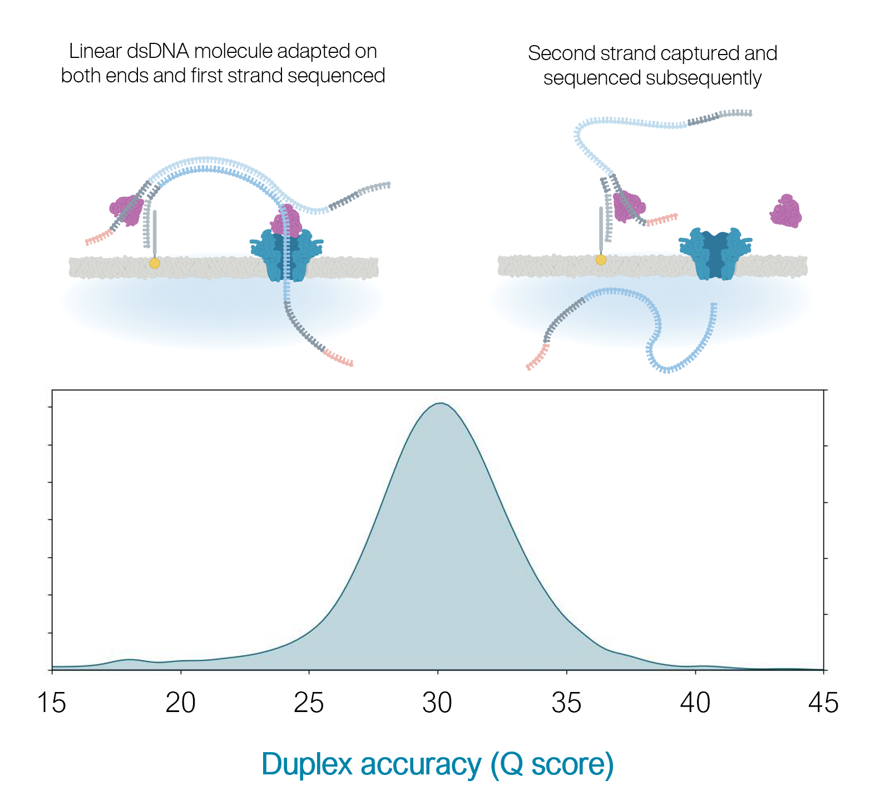

---

title: "Nanopore-based sequencing: introduction"
teaching: 20
exercises: 0
questions:
- "What is nanopore-based sequencing?"
objectives:
- "Understand details of ONT sequencing platforms."
keypoints:
- "ONT produce a range of popular sequencing platforms."
- "This technology is constantly advancing."
source: Rmd

---

```{r, include=FALSE}
library(here)
source("../bin/chunk-options.R")
knitr_fig_path("01-")
knitr::opts_chunk$set(fig.align = "left", echo = FALSE, message = FALSE, warning = FALSE)
```


### What is this module about?

 - Long-read sequencing with the Oxford Nanopore Technologies (ONT) platform.
 - WHY?
    - recent technology advances have led to a surge in popularly for this platform.
    - Huge scope for really exciting (and low cost) science
    - Concepts and skills learned here are transferable to other sequencing technologies.
 - WHAT?
    - Genome assembly
    - RNA-seq
    - Variant identification (single base & structural)
    - Base modification (e.g., methylation)
    - Metagenomics


### ONT platforms


```{r, out.width="80%"}
knitr::include_graphics("../fig/01-oxnano_2022.png")
```

### The MinION

[http://www.nature.com/news/data-from-pocket-sized-genome-sequencer-unveiled-1.14724](http://www.nature.com/news/data-from-pocket-sized-genome-sequencer-unveiled-1.14724)

 - It's a USB stick sequencer!!
 - Rough specs (2014)
   - 6-8 hour run time
   - sequence per run: ~110Mbp
   - average read length: 5,400bp
   - reads up to 10kbp
   
 - 2022 specs: 
   - can run for up to 72 hours
   - Max yield per run: 50Gbp
   - Max read length recorded: >4Mbp

```{r, out.width="50%"}
knitr::include_graphics("../fig/01-minion.png")
```

```{r, out.width="50%"}
knitr::include_graphics("../fig/01-nanopore-animation.gif")
```

[https://nanoporetech.com](https://nanoporetech.com)
[https://nanoporetech.com/products/specifications](https://nanoporetech.com/products/specifications)


### The MinION Mk1B

 - The MinION Mk1B is the current version of ONT's original sequencer.
 - Connects to a computer via USB.

```{r, out.width="50%"}
knitr::include_graphics("../fig/01-minion-usb.png")
```

[https://nanoporetech.com/products/minion](https://nanoporetech.com/products/minion)


<BR><BR><BR><BR>


```{r, out.width="50%"}
knitr::include_graphics("../fig/01-minion-mk1b.png")
```

### The MinION Mk1C

 - The MinION Mk1C provides a truly portable sequencing option, with built in compute and touchscreen.
 - For the price, however, the hardware is not particularly impressive.

<BR><BR><BR>
```{r, out.width="50%"}
knitr::include_graphics("../fig/01-minion-mk1c.png")
```

[https://nanoporetech.com/products/minion](https://nanoporetech.com/products/minion)


```{r, out.width="50%"}
knitr::include_graphics("../fig/01-mk1c-spec-top.png")
```

### The GridION

 - The GridION offers a "medium-throughput" option for Nanopore-based sequencing: 
 can run up to five flowcells at once.
 - The MinION (Mk1B and Mk1C) and GridION use the same flow cells
 - The Otago Genomics Facility has one of these.


```{r, out.width="50%"}
knitr::include_graphics("../fig/01-gridion.png")
```

[https://nanoporetech.com/products/gridion](https://nanoporetech.com/products/gridion)


### The Flongle

 - The Flongle uses an adapter to allow a smaller (and cheaper) flow cell to be used in the MinION and GridION devices.
 - Single-use system provides low-cost option for targeted sequencing (e.g., diagnostic applications).

```{r, out.width="50%"}
knitr::include_graphics("../fig/01-flongle.png")
```

[https://nanoporetech.com/products/flongle](https://nanoporetech.com/products/flongle)


### PromethION

 - The higher throughout PromethION uses a smaller cartridge-like flow cell. Two options: 24 or 48 flow cells.


```{r, out.width="50%"}
knitr::include_graphics("../fig/01-promethion48.jpg")
```

[https://nanoporetech.com/products/promethion](https://nanoporetech.com/products/promethion)

<BR>


```{r, out.width="50%"}
knitr::include_graphics("../fig/01-promethion-flowcell.jpg")
```


### Coming ~~soon~~ now: the P2


```{r, out.width="70%"}
knitr::include_graphics("../fig/01-p2.png")
```


Smaller device (standalone or connect to host computer) that can run Promethion flow cells.

[https://nanoporetech.com/products/p2](https://nanoporetech.com/products/p2)


### MinION flowcell characteristics

 - MinION flowcells typically have ~1200-1800 active pores (ONT guarantees at least 800 active pores).
 - Sequencing occurs at roughly 450 bases per second (ONT recommends keeping speed above 300 bases per second - additional reagents can be added to "refuel" the flowcell*)
 - BUT: pores are not constantly active, and can become blocked during the run 
 
 * [https://community.nanoporetech.com/protocols/experiment-companion-minknow/v/mke_1013_v1_revbm_11apr2016/refuelling-your-flow-cell](https://community.nanoporetech.com/protocols/experiment-companion-minknow/v/mke_1013_v1_revbm_11apr2016/refuelling-your-flow-cell)


### Nanopore technology


```{r, out.width="70%"}
knitr::include_graphics("../fig/01-nanopore.png")
```

[https://nanoporetech.com/how-it-works](https://nanoporetech.com/how-it-works)


### Nanopore technology

 - A motor protein (green) passes a strand of DNA through a nanopore (blue). The current is changed as the bases G, A, T and C pass through the pore in different combinations.

```{r, out.width="60%"}
knitr::include_graphics("../fig/01-sequencing-animated_0.gif")
```

[https://nanoporetech.com/how-it-works](https://nanoporetech.com/how-it-works)


### Nanopore movies

For more detailed information about ONT sequencing:

 - [https://nanoporetech.com/products/minion](https://nanoporetech.com/products/minion)
 - [https://nanoporetech.com/products/minion](https://nanoporetech.com/how-it-works)


### Technological advances...

 - Since its introduction, nanopore sequencing has seen a number of improvements.
 - The initial product was realtively slow, expensive (per base sequenced) and error prone (i.e., incorrect bases calls).
 - Incremental improvements have led to major advances in both speed and accuracy.

 
### 2D sequencing (prior to 2017)

 - Hairpin-based approach provided natural error detection methodology:
   - Link DNA strands with a hairpin adapter.
   - Sequence template strand followed by complement.
   - Basecall and compare sequences to produce consensus.


```{r, out.width="50%"}
knitr::include_graphics("../fig/01-nanopore-2d-reads.png")
```

Jain, et al. The Oxford Nanopore MinION: delivery of nanopore sequencing to the genomics community. Genome Biol 17, 239 (2016). 
[https://doi.org/10.1186/s13059-016-1103-0](https://doi.org/10.1186/s13059-016-1103-0)


### What happened to 2D reads?


```{r, out.width="50%", fig.align="center"}
knitr::include_graphics("../fig/01-2d-reads.png")
```

[https://bioinformatics.stackexchange.com/questions/5525/what-are-2d-reads-in-the-oxford-minion/5528](https://bioinformatics.stackexchange.com/questions/5525/what-are-2d-reads-in-the-oxford-minion/5528)


### The hairpin lawsuit...

 - PacBio (competitor in the long-read space) and ONT have filed a number of lawsuits against each other over the past few years.


```{r, out.width="50%", fig.align="center"}
knitr::include_graphics("../fig/01-europe-lawsuit.png")
```


[https://www.genomeweb.com/sequencing/pacbio-oxford-nanopore-settle-patent-dispute-europe](https://www.genomeweb.com/sequencing/pacbio-oxford-nanopore-settle-patent-dispute-europe)

 

### 1D$^2$ sequencing

 - In 2017 ONT announced the new 1D$^2$ chemistry
 - Showed higher accuracy that 1D (and SAID it was better than 2D)
 - It didn't last long... 


```{r, out.width="50%"}
knitr::include_graphics("../fig/01-1D2-accuracy.png")
```

 - Video at link below:

[https://nanoporetech.com/about-us/news/1d-squared-kit-available-store-boost-accuracy-simple-prep](https://nanoporetech.com/about-us/news/1d-squared-kit-available-store-boost-accuracy-simple-prep)


### Pore imporvements: the R10 pore

 - ONT introduced the new R10 pore in 2019 (previous was R9.4.1).
 - Main differences were *longer barrel* and *dual reader head:* gave improved resolution of homopolymer runs.


```{r, out.width="50%"}
knitr::include_graphics("../fig/01-r10-pore.png")
```

[https://nanoporetech.com/about-us/news/r103-newest-nanopore-high-accuracy-nanopore-sequencing-now-available-store](https://nanoporetech.com/about-us/news/r103-newest-nanopore-high-accuracy-nanopore-sequencing-now-available-store)


### R10.3 vs R9.4.1 performance 

 - With a bit more tweaking (to get to R10.3) ONT improved 1D (i.e., single-strand) sequencing accuracy, although throughput is still not as high as the R.9.4.1 pore.

```{r, out.width="70%"}
knitr::include_graphics("../fig/01-r10.3-results.png")
```

[https://nanoporetech.com/about-us/news/r103-newest-nanopore-high-accuracy-nanopore-sequencing-now-available-store](https://nanoporetech.com/about-us/news/r103-newest-nanopore-high-accuracy-nanopore-sequencing-now-available-store)


### Q20+: the return of 2D reads...

- The previous ONT products are "Q10" (we'll discuss this soon), meaning that the error rate is roughly 1 incorrect base call per 10 bases (that's high!)
- The new "Q20+" products are now available  - moves to less than 1 error per 100 bases (a little more respectable, but still well below short-read technologies like Illumina).
- Upgrade includes a return to the "2D" approach.


```{r, out.width="50%", fig.align="center"}
knitr::include_graphics("../fig/01-lawsuit2020.png")
```

[https://www.genomeweb.com/sequencing/jury-invalidates-pacific-biosciences-patents-lawsuit-against-oxford-nanopore#.YOt8e26xXUI](https://www.genomeweb.com/sequencing/jury-invalidates-pacific-biosciences-patents-lawsuit-against-oxford-nanopore#.YOt8e26xXUI)


### Making improvements

```{r, out.width="80%"}
knitr::include_graphics("../fig/01-ont-screening.png")
```

[https://nanoporetech.com/resource-centre/london-calling-2022-update-oxford-nanopore-technologies](https://nanoporetech.com/resource-centre/london-calling-2022-update-oxford-nanopore-technologies)


### Q20+ and Kit 14

```{r, out.width=480}
knitr::include_graphics("../fig/01-ont-q20.png")
```

[https://nanoporetech.com/q20plus-chemistry](https://nanoporetech.com/q20plus-chemistry)


### Nanopore accuracy


```{r, out.width="50%"}
knitr::include_graphics("../fig/01-ont-accuracy.png")
```

[https://nanoporetech.com/accuracy](https://nanoporetech.com/q20plus-chemistry)


### Duplex (and simplex) accuracy


```{r, out.width="80%"}

```

What aren't they telling us about those duplex reads...? 

[https://nanoporetech.com/resource-centre/london-calling-2022-update-oxford-nanopore-technologies](https://nanoporetech.com/resource-centre/london-calling-2022-update-oxford-nanopore-technologies)


### Coming... sometime - the Mk1D


```{r, out.width="70%"}
knitr::include_graphics("../fig/01-ont-mk1d.png")
```

[https://nanoporetech.com/resource-centre/london-calling-2022-update-oxford-nanopore-technologies](https://nanoporetech.com/resource-centre/london-calling-2022-update-oxford-nanopore-technologies)
[https://nanoporetech.com/products/minion-mk1d](https://nanoporetech.com/products/minion-mk1d)


### More Nanopore: London Calling 2022


```{r, out.width="50%", fig.cap="a figure caption"}

knitr::include_graphics("../fig/01-lc22.png")
```

 - Online conference held in May 2022
 - Talk videos available online
 - LOTS of really cool announcements and research applications

[https://nanoporetech.com/lc22](https://nanoporetech.com/lc22)


