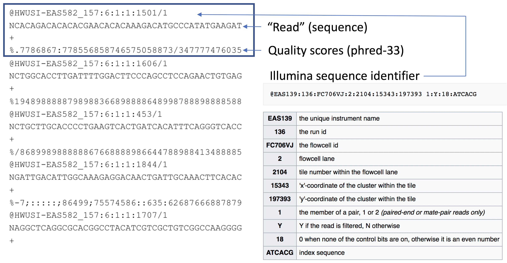

```{r, include=FALSE}
source("../bin/chunk-options.R")
knitr_fig_path("03-")
```

> possible example dataset of E coli available from https://zenodo.org/record/1257429

## Data generation

During the sequencing run, the electric trace ("squiggle") data are stored in `.fast5` files, which utilse the HDF5 file format:
 
"Hierarchical Data Format (HDF) is a set of file formats (HDF4, HDF5) designed to store and organize large amounts of data. Originally 
developed at the National Center for Supercomputing Applications, it is supported by The HDF Group, a non-profit corporation whose 
mission is to ensure continued development of HDF5 technologies and the continued accessibility of data stored in HDF."

[https://www.neonscience.org/resources/learning-hub/tutorials/about-hdf5](https://www.neonscience.org/resources/learning-hub/tutorials/about-hdf5)

 - A single ONT flowcell produces a large amount of data - very roughly, 1Gbp of sequence data requires 1GB of storage (e.g., as gzipped fastq), 
 but to generate 1Gbp of sequence requires 10GB of electrical trace data, so potentially up to 500GB of files for a 72 hour MinION run 
 (a 30Gbp run will typically generate 300-400GB of `.fast5` files).

 - As the data are generated, they are saved as `.fast5` files in either the `fast5_pass` or `fast5_fail` folders, depending on whether reads 
 passed or failed the quality assessment process, based on the criteria that were specified when setting up the run in MinKNOW. 

 - Each `.fast5` file contains squiggle data for 1000 reads, so MANY files are created in a single sequencing run (e.g., a run generating five millions reads 
 will produce 5000 `.fast5` files, which are split across the `fast5_pass` and `fast5_fail` folders).

 - If realtime basecalling is performed during the run, then there will also be teh equivalent number of `.fastq` files generated (1000 reads per file), 
 split across the `fastq_pass` and `fastq_fail` folders.


## Basecalling workflow

In order to analyse the data from a sequencing run, the FAST5 "squiggle" data needs to be converted to base calls.
The ONT software application "guppy" can be used to process FAST5 data into FASTQ format - this is the de facto standard 
for storage of sequence data and associated base-level quality scores.


```{r, echo=FALSE, out.align="center", out.height=180, eval=FALSE}
knitr::include_graphics("../fig/01-nanopore-workflow.png")
```

 - ONT provides software (MinKNOW) for operating the MinION, and for generating the sequence data (e.g., the `guppy` basecaller).
 - Once the raw FAST5 data have been converted to basecalls, we can use more familiar tools for quality assessment and analysis (e.g., FastQC).

[https://nanoporetech.com/nanopore-sequencing-data-analysis](https://nanoporetech.com/nanopore-sequencing-data-analysis)

The current version of the Guppy software can be downloaded from the "Software Downloads" section of the Nanopore Community website:

https://community.nanoporetech.com/downloads

Note that you will need to create a login to access the website.  

Today we will be using `guppy_basecaller` on the NeSI system.


## Basecalling: `guppy`

 - `guppy` is a neural network based basecaller.
    - analyses the electrical trace data and predicts base 
    - it is GPU-aware, and can basecall in real time 
    - can also call base modifications (e.g., 5mC, 6mA)
    - high accuracy mode (slower) and super-high accuracy mode (even slower) can improve basecalls post-sequencing
 - The software is provided by ONT, and the source code is available via a developer agreement.
 - Output is the standard "FASTQ" format for sequence data.


~~~
module load ont-guppy-gpu/6.2.1

guppy_basecaller --help
~~~
{: .bash}

~~~
: Guppy Basecalling Software, (C) Oxford Nanopore Technologies plc. Version 6.2.1+6588110, minimap2 version 2.22-r1101

Use of this software is permitted solely under the terms of the end user license agreement (EULA).By running, copying or accessing this software, you are demonstrating your acceptance of the EULA.
The EULA may be found in /scale_wlg_persistent/filesets/opt_nesi/CS400_centos7_bdw/ont-guppy-gpu/6.2.1/bin

Usage:

With config file:
  guppy_basecaller -i <input path> -s <save path> -c <config file> [options]
With flowcell and kit name:
  guppy_basecaller -i <input path> -s <save path> --flowcell <flowcell name>
    --kit <kit name>
List supported flowcells and kits:
  guppy_basecaller --print_workflows

Use GPU for basecalling:
  guppy_basecaller -i <input path> -s <save path> -c <config file>
    --device <cuda device name> [options]

Command line parameters:
-c [ --config ]
        Configuration file for application.
-d [ --data_path ]
        Path to use for loading any data files the application requires.
-x [ --device ]
        Specify GPU device: 'auto', or 'cuda:<device_id>'.
-s [ --save_path ]
        Path to save output files.
--ping_url
        URL to send pings to.
--trace_domains_config
        Configuration file containing list of trace domains to include in verbose logging (if enabled)
--progress_stats_frequency
        Frequency in seconds in which to report progress statistics, if supplied will replace the default progress display.
--ping_segment_duration
        Duration in minutes of each ping segment.
-z [ --quiet ]
        Quiet mode. Nothing will be output to STDOUT if this option is set.
--verbose_logs
        Enable verbose logs.
--disable_pings
        Disable the transmission of telemetry pings.
-h [ --help ]
        Display the application usage help.
-v [ --version ]
        Display the application version information.
--trace_category_logs
        Enable trace logs - list of strings with the desired names.
-r [ --recursive ]
        Search for input file recursively.
-i [ --input_path ]
        Path to input files.
--input_file_list
        Optional file containing list of input fast5 files to process from the input_path.
-l [ --read_id_list ]
        File containing list of read ids to filter to.
--sample_sheet
        Optional file containing sample sheet.  Used to provide an alias for barcode results.
--read_batch_size
        Maximum batch size, in reads, for grouping input files.
--nested_output_folder
        If flagged output FastQ/BAM files will be written to a nested folder structure, based on: protocol_group/sample/protocol/qscore_pass_fail/barcode_arrangement/
--barcode_nested_output_folder
        If flagged output FastQ/BAM files will be written to a nested folder structure, based on: protocol_group/barcode_arrangement/sample/protocol/qscore_pass_fail/
--fast5_out
        Choice of whether to do fast5 output.
--resume
        Resume a previous basecall run using the same output folder.
-q [ --records_per_fastq ]
        Maximum number of records per fastq file, 0 means use a single file (per worker, per run id).
--bam_methylation_threshold
        The value below which a predicted methylation probability will not be emitted into a BAM file, expressed as a percentage.
--compress_fastq
        Compress fastq output files with gzip.
--bam_out
        Output BAM files.
--index
        Output BAM index file.
--moves_out
        Return move table in output BAM file.
--max_queued_reads
        Maximum number of reads in input queue.
--trim_threshold
        Threshold above which data will be trimmed (in standard deviations of current level distribution).
--trim_min_events
        Adapter trimmer minimum stride intervals after stall that must be seen.
--max_search_len
        Maximum number of samples to search through for the stall
--override_scaling
        Manually provide scaling parameters rather than estimating them from each read.
--scaling_med
        Median current value to use for manual scaling.
--scaling_mad
        Median absolute deviation to use for manual scaling.
--trim_strategy
        Trimming strategy to apply: 'dna' or 'rna' (or 'none' to disable trimming)
--dmean_win_size
        Window size for coarse stall event detection
--dmean_threshold
        Threshold for coarse stall event detection
--jump_threshold
        Threshold level for rna stall detection
--pt_scaling
        Enable polyT/adapter max detection for read scaling.
--pt_median_offset
        Set polyT median offset for setting read scaling median.
--adapter_pt_range_scale
        Set polyT/adapter range scale for setting read scaling median absolute deviation.
--pt_required_adapter_drop
        Set minimum required current drop from adapter max to polyT detection.
--pt_minimum_read_start_index
        Set minimum index for read start sample required to attempt polyT scaling.
--as_model_file
        Path to JSON model file for adapter scaling.
--as_gpu_runners_per_device
        Number of runners per GPU device for adapter scaling.
--as_cpu_threads_per_scaler
        Number of CPU worker threads per adapter scaler.
--as_reads_per_runner
        Maximum reads per runner for adapter scaling.
--as_num_scalers
        Number of parallel scalers for adapter scaling.
--noisiest_section_scaling_max_size
        Threshold read size in samples under which nosiest-section scaling will be performed.
-m [ --model_file ]
        Path to JSON model file.
-k [ --kernel_path ]
        Path to GPU kernel files location (only needed if builtin_scripts is false).
--builtin_scripts
        Whether to use GPU kernels that were included at compile-time.
--chunk_size
        Stride intervals per chunk.
--chunks_per_runner
        Maximum chunks per runner.
--chunks_per_caller
        Soft limit on number of chunks in each caller's queue. New reads will not be queued while this is exceeded.
--high_priority_threshold
        Number of high priority chunks to process for each medium priority chunk.
--medium_priority_threshold
        Number of medium priority chunks to process for each low priority chunk.
--overlap
        Overlap between chunks (in stride intervals).
--gpu_runners_per_device
        Number of runners per GPU device.
--cpu_threads_per_caller
        Number of CPU worker threads per basecaller.
--num_callers
        Number of parallel basecallers to create.
--num_base_mod_threads
        The number of threads to use for Remora modified base detection in GPU basecalling mode.
--post_out
        Return full posterior matrix in output fast5 file and/or called read message from server.
--stay_penalty
        Scaling factor to apply to stay probability calculation during transducer decode.
--qscore_offset
        Qscore calibration offset.
--qscore_scale
        Qscore calibration scale factor.
--temp_weight
        Temperature adjustment for weight matrix in softmax layer of RNN.
--temp_bias
        Temperature adjustment for bias vector in softmax layer of RNN.
--beam_cut
        Beam score cutoff for beam search decoding.
--beam_width
        Beam score cutoff for beam search decoding.
--duplex_window_size_min
        Minimum window size to use for prefix search in duplex decoding.
--duplex_window_size_max
        Maximum window size to use for prefix search in duplex decoding.
--disable_qscore_filtering
        Disable filtering of reads into PASS/FAIL folders based on min qscore.
--min_qscore
        Minimum acceptable qscore for a read to be filtered into the PASS folder.
--reverse_sequence
        Reverse the called sequence (for RNA sequencing).
--u_substitution
        Substitute 'U' for 'T' in the called sequence (for RNA sequencing).
--log_speed_frequency
        How often to print out basecalling speed.
--int8_mode
        Enable quantised int8 mode for kernels which support it.
--barcode_kits
        Space separated list of barcoding kit(s) or expansion kit(s) to detect against. Must be in double quotes.
--trim_barcodes
        Trim the barcodes from the sequences in the output files.
--trim_adapters
        Trim the adapters from the sequences in the output files.
--trim_primers
        Trim the primers from the sequences in the output files.
--num_extra_bases_trim
        How vigorous to be in trimming the barcode. Default is 0 i.e. the length of the detected barcode. A positive integer means extra bases will be trimmed, a negative number is how many fewer bases (less vigorous) will be trimmed.
--min_score_barcode_front
        Minimum score to consider a front barcode to be a valid barcode alignment.
--min_score_barcode_rear
        Minimum score to consider a rear barcode to be a valid alignment (and min_score_front will then be used for the front only when this is set).
--min_score_barcode_mask
        Minimum score for a barcode context to be considered a valid alignment.
--min_score_adapter
        Minimum score for an adapter to be considered a valid alignment.
--min_score_primer
        Minimum score for a primer to be considered to be a valid alignment.
--min_score_adapter_mid
        Minimum score for a mid-strand adapter to be considered a valid alignment.
--min_score_barcode_mid
        Minimum score for a barcode to be detected in the middle of a read.
--front_window_size
        Window size for the beginning barcode.
--rear_window_size
        Window size for the ending barcode.
--require_barcodes_both_ends
        Reads will only be classified if there is a barcode above the min_score at both ends of the read.
--allow_inferior_barcodes
        Reads will still be classified even if both the barcodes at the front and rear (if applicable) were not the best scoring barcodes above the min_score.
--detect_barcodes
        Detect barcode sequences at the front and rear of the read.
--detect_adapter
        Detect adapter sequences at the front and rear of the read.
--detect_primer
        Detect primer sequences at the front and rear of the read.
--detect_mid_strand_barcodes
        Search for barcodes through the entire length of the read.
--detect_mid_strand_adapter
        Detect adapter sequences within reads.
--num_barcoding_buffers
        Number of GPU memory buffers to allocate to perform barcoding into. Controls level of parallelism on GPU for barcoding.
--num_mid_barcoding_buffers
        Number of GPU memory buffers to allocate to perform barcoding into. Controls level of parallelism on GPU for mid barcoding.
--num_barcoding_threads
        Number of worker threads to use for barcoding.
--num_reads_per_barcoding_buffer
        The maximum number of reads to process at once in each barcoding buffer.
--lamp_kit
        LAMP barcoding kit to perform LAMP detection against.
--min_score_lamp
        Minimum score for a LAMP barcode to be classified.
--min_score_lamp_mask
        Minimum score for a LAMP barcode mask context to be classified.
--min_score_lamp_target
        Minimum score for a LAMP target to be classified.
--min_length_lamp_context
        Minimum align length for a LAMP barcode mask context to be classified.
--min_length_lamp_target
        Minimum align length for a LAMP target to be classified.
--additional_lamp_context_bases
        Number of bases from a lamp FIP barcode context to append to the front and read of the FIP barcode before performing matching. Default is 2.
--num_read_splitting_buffers
        Number of GPU memory buffers to allocate to perform read splitting. Controls level of parallelism on GPU for read splitting using mid adapter detection.
--num_read_splitting_threads
        Number of worker threads to use for read splitting.
--min_score_read_splitting
        Minimum alignment score for the mid adapter on which to split the read.
--do_read_splitting
        Perform read splitting based on mid-strand adapter detection.
--max_read_split_depth
        The maximum number of iterations of read splitting that should be performed.
--calib_reference
        Reference FASTA file containing calibration strand.
--calib_detect
        Enable calibration strand detection and filtering.
-a [ --align_ref ]
        Reference FASTA or index file.
--bed_file
        Path to .bed file containing areas of interest in reference genome.
--align_type
        Specify whether you want full or coarse alignment. Valid values are (auto/full/coarse).
--num_alignment_threads
        Number of worker threads to use for alignment.
--print_workflows
        Output available workflows.
--flowcell
        Flowcell to find a configuration for.
--kit
        Kit to find a configuration for.
~~~
{: .output}

<BR><BR><BR><BR><BR><BR>
# Recap: FASTQ data format


## Assessing sequence quality: phred scores


```{r, echo=FALSE, out.align="center", out.height=250}
knitr::include_graphics("../fig/01-phred.png")
```

### Ewing B, Green P. (1998): Base-calling of automated sequencer traces using phred. II. Error probabilities. Genome Res. 8(3):186-194.


```{r, echo=FALSE, out.align="center", out.height=150}
knitr::include_graphics("../fig/01-phred2.png")
```

Can use ASCII to represent quality scores by adding 33 to the phred score and converting to ASCII.
 - Quality score of 38 becomes 38+33=71: “G” 

[http://en.wikipedia.org/wiki/Phred_quality_score](http://en.wikipedia.org/wiki/Phred_quality_score)


```{r, echo=FALSE, out.align="center", out.height=300}
knitr::include_graphics("../fig/01-asciitable.png")
```

 - The FASTQ format allows the storage of both sequence and quality information for each read.
 - This is a compact text-based format that has become the de facto standard for storing data from next generation sequencing experiments.


FASTQ format:

```{r, echo=FALSE, out.align="center", out.height=250}
knitr::include_graphics("../fig/01-fastq1.png")
```

http://en.wikipedia.org/wiki/FASTQ_format

*** =right
 - Line 1: '@' character followed by sequence identifier and optional description.
 - Line 2: base calls.
 - Line 3: '+' character, ptionally followed by the same sequence identifier (and description) again.
 - Line 4: quality scores


## Fastq format


```{r, echo=FALSE, out.align="center", out.height=475}

```

### http://en.wikipedia.org/wiki/FASTQ_format


## Quality Assessment

 - The information in the FASTQ file can be used to assess the read quality.
 - A number of tools are available on the unix/linux command line, and/or within R for manipulating FASTQ data.


## Sequence alignment

 - If a “reference” genome exists for the organism you are sequencing, reads can be “aligned” to the reference.
 - This involves finding the place in the reference genome that each read matches to.
 - Due to high sequence similarity within members of the same species, most reads should map to the reference.


## Tools for generating alignments

 - There are MANY software packages available for aligning data from next generation sequencing experiments.
 - The two "original" short read aligners were:
    - BWA: http://bio-bwa.sourceforge.net
    - Bowtie: http://bowtie-bio.sourceforge.net
 - More recently MANY more "aligners" have been developed
 - For long-read data, ONT provides the Minimap2 aligner (but there are also a number of other options).


## E coli data set on NeSI

Guppy command from slurm file:

```
guppy_basecaller -i fast5_pass_subset  -s fastq_fastmodel_subset \
 --config /opt/nesi/CS400_centos7_bdw/ont-guppy-gpu/6.2.1/data/dna_r9.4.1_450bps_fast.cfg  \
 --device auto  --recursive --records_per_fastq 4000 --min_qscore 7 --compress_fastq
```

## Existing tutorials 

https://labs.epi2me.io/nbindex/

- https://labs.epi2me.io/notebooks/Introduction_to_Fast5_files.html
- https://labs.epi2me.io/notebooks/Basic_QC_Tutorial.html

https://denbi-nanopore-training-course.readthedocs.io/en/latest/data.html