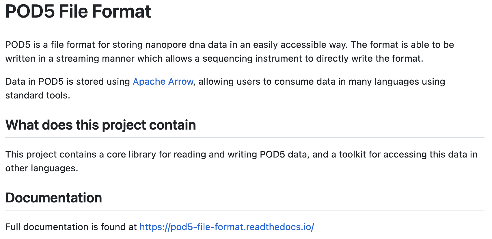
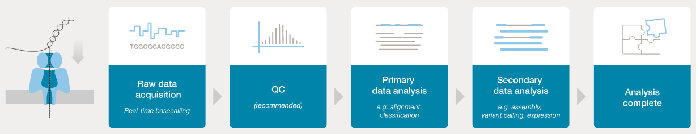
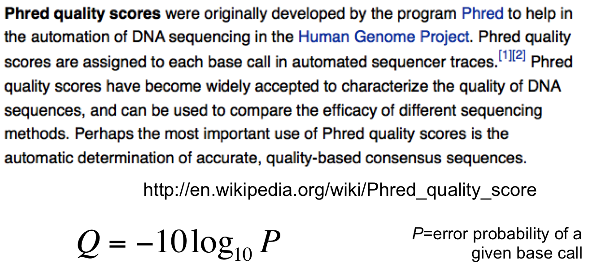
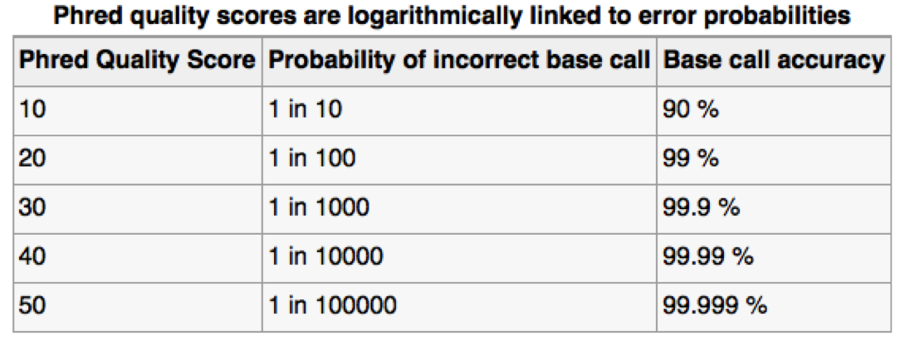
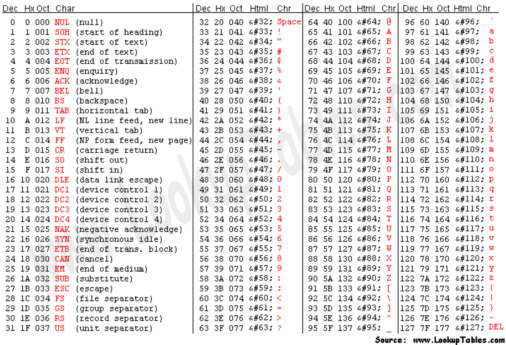
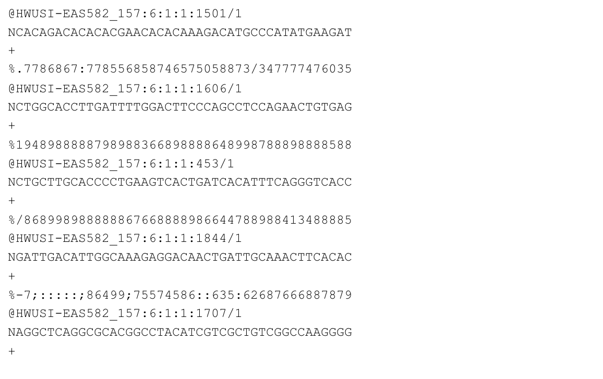

```{r, include=FALSE}
source("../bin/chunk-options.R")
knitr_fig_path("03-")
knitr::opts_chunk$set(fig.align = "left", echo = FALSE, message = FALSE, warning = FALSE, fig.alt = "", fig.cap = "")
```

### FAST5 / HDF5 data

 - Each pore produces a HUGE amount of data - very roughly, 1Gbp of sequence data requires 1GB of storage (e.g., as gzipped fastq), but to generate 1Gbp of sequence requires 10GB of electrical trace data, so potentially up to 500GB of files for a 72 hour MinION run.
 - (Until recently) the electrical trace data was saved as “.fast5”, which utilises the HDF5 file format:

“Hierarchical Data Format (HDF) is a set of file formats (HDF4, HDF5) designed to store and organize large amounts of data. Originally developed at the National Center for Supercomputing Applications, it is supported by The HDF Group, a non-profit corporation whose mission is to ensure continued development of HDF5 technologies and the continued accessibility of data stored in HDF.”

[https://www.neonscience.org/resources/learning-hub/tutorials/about-hdf5](https://www.neonscience.org/resources/learning-hub/tutorials/about-hdf5)
 
### POD5 format

 - Over the past year (or so) ONT have introduced the POD5 format for storing data.
 - This is a more efficient file format (e.g., faster read and write, smaller) than FAST5.
 - New ONT tools (e.g., the dorado basecaller) can process POD5 data.
 - ONT offers tools (online and Python-based) for converting between FAST5 and POD5:

```{r, out.width="50%"}

```

[https://pod5.nanoporetech.com/](https://pod5.nanoporetech.com/)


### Basecalling workflow

In order to analyse the data from a sequencing run, the POD5/FAST5 "squiggle" data needs to be converted to base calls.
The ONT software application `dorado` can be used to process POD5/FAST5 data and generate basecalls and quality information.

Previously this was outoput as FASTQ - a widely used format for storage of sequence data and associated base-level quality scores.  This
same information is now stored in (unaligned) BAM format (BAM is a binary version of SAM format, which was created for storing aligment information, along with sequence data and quality scores for reads, but it can also be used to stored unaligned data: basecalls and quality scores).


```{r, out.width="80%"}

```

 - ONT provides software (MinKNOW) for operating the MinION, and for generating the sequence data (e.g., the `dorado` basecaller).
 - Once the raw data have been converted to basecalls, we can use more familiar tools for quality assessment and analysis (e.g., FastQC).

[https://nanoporetech.com/nanopore-sequencing-data-analysis](https://nanoporetech.com/nanopore-sequencing-data-analysis)

The current version of the `dorado` software can be downloaded from GitHub:

[https://github.com/nanoporetech/dorado](https://github.com/nanoporetech/dorado)

Today we will be using `dorado` on the NeSI system to generate FASTQ data from a set of POD5 files.


## Recap: FASTQ data format


### Assessing sequence quality: phred scores

```{r, out.width="50%"}

```

Ewing B, Green P. (1998): Base-calling of automated sequencer traces using phred. II. Error probabilities. Genome Res. 8(3):186-194.


```{r, out.width="50%"}

```

Can use ASCII to represent quality scores by adding 33 to the phred score and converting to ASCII.
 - Quality score of 38 becomes 38+33=71: “G” 

[http://en.wikipedia.org/wiki/Phred_quality_score](http://en.wikipedia.org/wiki/Phred_quality_score)


```{r, out.width="80%"}

```

 - The FASTQ format allows the storage of both sequence and quality information for each read.
 - This is a compact text-based format that has become the de facto standard for storing data from next generation sequencing experiments.


FASTQ format:

```{r, out.width="60%"}

```

http://en.wikipedia.org/wiki/FASTQ_format

 - Line 1: '@' character followed by sequence identifier and optional description.
 - Line 2: base calls.
 - Line 3: '+' character, optionally followed by the same sequence identifier (and description) again.
 - Line 4: quality scores


### BAM instead of FASTQ

`dorado` outputs sequence and quality information to BAM format by default.  

BAM is a binary (compressed) version of the text-based SAM format (warning, not a thrilling read):

[https://samtools.github.io/hts-specs/SAMv1.pdf](https://samtools.github.io/hts-specs/SAMv1.pdf)


## E coli data set on NeSI

For this part of the workshop we are working at:

~~~
~/obss_2023/nanopore/ecoli-data/
~~~
{: .output}

Let's change to that directory now:

~~~
cd ~/obss_2023/nanopore/ecoli-data/
~~~
{: .bash}

POD5 files from sequencing *E. coli* are available in the directory:

~~~
pod5_pass
~~~
{: .output}

~~~
ls -1 pod5_pass
~~~
{: .bash}

~~~
ecoli_pass_0.pod5
ecoli_pass_10.pod5
ecoli_pass_11.pod5
ecoli_pass_12.pod5
ecoli_pass_14.pod5
ecoli_pass_15.pod5
ecoli_pass_1.pod5
ecoli_pass_2.pod5
ecoli_pass_3.pod5
ecoli_pass_4.pod5
ecoli_pass_5.pod5
ecoli_pass_6.pod5
ecoli_pass_8.pod5
~~~
{: .output}


### Basecalling: `dorado`

 - `dorado` is a neural network based basecaller.
    - analyses the electrical trace data and predicts base 
    - it is GPU-aware, and can basecall in real time 
    - can also call base modifications (e.g., 5mC, 5hmC, 6mA)
    - common to use the "fast" basecalling model to generate basecalls and quality scores during sequening run.
    - high accuracy mode (HAC: slower) and super-high accuracy mode (SUP: even slower) can improve basecalls post-sequencing
 - Output is unaligned BAM format.

On NeSI:

~~~
module spider Dorado
~~~
{: .bash}

~~~
------------------------------------------------------------------------------
  Dorado:
------------------------------------------------------------------------------
    Description:
      High-performance, easy-to-use, open source basecaller for Oxford
      Nanopore reads.

     Versions:
        Dorado/0.2.1
        Dorado/0.2.4
        Dorado/0.3.0
        Dorado/0.3.1
        Dorado/0.3.2
        Dorado/0.3.4-rc2
        Dorado/0.3.4
        Dorado/0.4.0
        Dorado/0.4.1
        Dorado/0.4.2
        Dorado/0.4.3

------------------------------------------------------------------------------
  For detailed information about a specific "Dorado" module (including how to load the modules) use the module's full name.
  For example:

     $ module spider Dorado/0.4.3
------------------------------------------------------------------------------
~~~
{: .output}

~~~
module load Dorado/0.4.3

dorado --help
~~~
{: .bash}

~~~
Usage: dorado [options] subcommand

Positional arguments:
aligner
basecaller
demux
download
duplex
summary

Optional arguments:
-h --help               shows help message and exits
-v --version            prints version information and exits
-vv                     prints verbose version information and exits
~~~
{: .output}

### Using `dorado` on NeSI

Information about using `dorado` on NeSI can be found at:

[https://support.nesi.org.nz/hc/en-gb/articles/6623692647951-Dorado](https://support.nesi.org.nz/hc/en-gb/articles/6623692647951-Dorado)

In order to use `dorado` to generate basecalls from POD5 of FAST5 data, we need to select a "model". 

Each model has been trained to generate specific types of basecalls (i.e., unmodified DNA, RNA, modified DNA: 5mC, 5hmC, 6mA), for specific types of data (flowcell version: 9.4.1, 10.4.1; *plex: simplex, duplex; speed: 260bps, 400bps or 70bps/130bp for RNA), at differing levels of accuracy (FAST, HAC, SUP).

We can see what models are available via:

~~~
dorado download --list
~~~
{: .bash}

~~~
[2023-11-26 01:37:39.797] [info] > modification models
[2023-11-26 01:37:39.797] [info]  - dna_r10.4.1_e8.2_260bps_fast@v3.5.2_5mCG@v2
[2023-11-26 01:37:39.797] [info]  - dna_r10.4.1_e8.2_260bps_fast@v4.0.0_5mCG_5hmCG@v2
[2023-11-26 01:37:39.797] [info]  - dna_r10.4.1_e8.2_260bps_fast@v4.1.0_5mCG_5hmCG@v2
[2023-11-26 01:37:39.797] [info]  - dna_r10.4.1_e8.2_260bps_hac@v3.5.2_5mCG@v2
[2023-11-26 01:37:39.797] [info]  - dna_r10.4.1_e8.2_260bps_hac@v4.0.0_5mCG_5hmCG@v2
[2023-11-26 01:37:39.797] [info]  - dna_r10.4.1_e8.2_260bps_hac@v4.1.0_5mCG_5hmCG@v2
[2023-11-26 01:37:39.797] [info]  - dna_r10.4.1_e8.2_260bps_sup@v3.5.2_5mCG@v2
[2023-11-26 01:37:39.797] [info]  - dna_r10.4.1_e8.2_260bps_sup@v4.0.0_5mCG_5hmCG@v2
[2023-11-26 01:37:39.797] [info]  - dna_r10.4.1_e8.2_260bps_sup@v4.1.0_5mCG_5hmCG@v2
[2023-11-26 01:37:39.797] [info]  - dna_r10.4.1_e8.2_400bps_fast@v3.5.2_5mCG@v2
[2023-11-26 01:37:39.797] [info]  - dna_r10.4.1_e8.2_400bps_fast@v4.0.0_5mCG_5hmCG@v2
[2023-11-26 01:37:39.797] [info]  - dna_r10.4.1_e8.2_400bps_fast@v4.1.0_5mCG_5hmCG@v2
[2023-11-26 01:37:39.797] [info]  - dna_r10.4.1_e8.2_400bps_fast@v4.2.0_5mCG_5hmCG@v2
[2023-11-26 01:37:39.797] [info]  - dna_r10.4.1_e8.2_400bps_hac@v3.5.2_5mCG@v2
[2023-11-26 01:37:39.797] [info]  - dna_r10.4.1_e8.2_400bps_hac@v4.0.0_5mCG_5hmCG@v2
[2023-11-26 01:37:39.797] [info]  - dna_r10.4.1_e8.2_400bps_hac@v4.1.0_5mCG_5hmCG@v2
[2023-11-26 01:37:39.797] [info]  - dna_r10.4.1_e8.2_400bps_hac@v4.2.0_5mCG_5hmCG@v2
[2023-11-26 01:37:39.797] [info]  - dna_r10.4.1_e8.2_400bps_sup@v3.5.2_5mCG@v2
[2023-11-26 01:37:39.797] [info]  - dna_r10.4.1_e8.2_400bps_sup@v4.0.0_5mCG_5hmCG@v2
[2023-11-26 01:37:39.797] [info]  - dna_r10.4.1_e8.2_400bps_sup@v4.1.0_5mCG_5hmCG@v2
[2023-11-26 01:37:39.797] [info]  - dna_r10.4.1_e8.2_400bps_sup@v4.2.0_5mC@v2
[2023-11-26 01:37:39.798] [info]  - dna_r10.4.1_e8.2_400bps_sup@v4.2.0_5mCG_5hmCG@v2
[2023-11-26 01:37:39.798] [info]  - dna_r10.4.1_e8.2_400bps_sup@v4.2.0_5mCG_5hmCG@v3.1
[2023-11-26 01:37:39.798] [info]  - dna_r10.4.1_e8.2_400bps_sup@v4.2.0_5mC_5hmC@v1
[2023-11-26 01:37:39.798] [info]  - dna_r10.4.1_e8.2_400bps_sup@v4.2.0_6mA@v2
[2023-11-26 01:37:39.798] [info]  - dna_r10.4.1_e8.2_400bps_sup@v4.2.0_6mA@v3
[2023-11-26 01:37:39.798] [info]  - dna_r9.4.1_e8_fast@v3.4_5mCG@v0.1
[2023-11-26 01:37:39.798] [info]  - dna_r9.4.1_e8_fast@v3.4_5mCG_5hmCG@v0
[2023-11-26 01:37:39.798] [info]  - dna_r9.4.1_e8_hac@v3.3_5mCG@v0.1
[2023-11-26 01:37:39.798] [info]  - dna_r9.4.1_e8_hac@v3.3_5mCG_5hmCG@v0
[2023-11-26 01:37:39.798] [info]  - dna_r9.4.1_e8_sup@v3.3_5mCG@v0.1
[2023-11-26 01:37:39.798] [info]  - dna_r9.4.1_e8_sup@v3.3_5mCG_5hmCG@v0
[2023-11-26 01:37:39.798] [info]  - rna004_130bps_sup@v3.0.1_m6A_DRACH@v1
[2023-11-26 01:37:39.798] [info] > stereo models
[2023-11-26 01:37:39.798] [info]  - dna_r10.4.1_e8.2_4khz_stereo@v1.1
[2023-11-26 01:37:39.798] [info]  - dna_r10.4.1_e8.2_5khz_stereo@v1.1
[2023-11-26 01:37:39.798] [info] > simplex models
[2023-11-26 01:37:39.798] [info]  - dna_r10.4.1_e8.2_260bps_fast@v3.5.2
[2023-11-26 01:37:39.798] [info]  - dna_r10.4.1_e8.2_260bps_fast@v4.0.0
[2023-11-26 01:37:39.798] [info]  - dna_r10.4.1_e8.2_260bps_fast@v4.1.0
[2023-11-26 01:37:39.798] [info]  - dna_r10.4.1_e8.2_260bps_hac@v3.5.2
[2023-11-26 01:37:39.798] [info]  - dna_r10.4.1_e8.2_260bps_hac@v4.0.0
[2023-11-26 01:37:39.798] [info]  - dna_r10.4.1_e8.2_260bps_hac@v4.1.0
[2023-11-26 01:37:39.798] [info]  - dna_r10.4.1_e8.2_260bps_sup@v3.5.2
[2023-11-26 01:37:39.798] [info]  - dna_r10.4.1_e8.2_260bps_sup@v4.0.0
[2023-11-26 01:37:39.798] [info]  - dna_r10.4.1_e8.2_260bps_sup@v4.1.0
[2023-11-26 01:37:39.798] [info]  - dna_r10.4.1_e8.2_400bps_fast@v3.5.2
[2023-11-26 01:37:39.798] [info]  - dna_r10.4.1_e8.2_400bps_fast@v4.0.0
[2023-11-26 01:37:39.798] [info]  - dna_r10.4.1_e8.2_400bps_fast@v4.1.0
[2023-11-26 01:37:39.798] [info]  - dna_r10.4.1_e8.2_400bps_fast@v4.2.0
[2023-11-26 01:37:39.798] [info]  - dna_r10.4.1_e8.2_400bps_hac@v3.5.2
[2023-11-26 01:37:39.798] [info]  - dna_r10.4.1_e8.2_400bps_hac@v4.0.0
[2023-11-26 01:37:39.798] [info]  - dna_r10.4.1_e8.2_400bps_hac@v4.1.0
[2023-11-26 01:37:39.798] [info]  - dna_r10.4.1_e8.2_400bps_hac@v4.2.0
[2023-11-26 01:37:39.798] [info]  - dna_r10.4.1_e8.2_400bps_sup@v3.5.2
[2023-11-26 01:37:39.798] [info]  - dna_r10.4.1_e8.2_400bps_sup@v4.0.0
[2023-11-26 01:37:39.798] [info]  - dna_r10.4.1_e8.2_400bps_sup@v4.1.0
[2023-11-26 01:37:39.798] [info]  - dna_r10.4.1_e8.2_400bps_sup@v4.2.0
[2023-11-26 01:37:39.798] [info]  - dna_r9.4.1_e8_fast@v3.4
[2023-11-26 01:37:39.798] [info]  - dna_r9.4.1_e8_hac@v3.3
[2023-11-26 01:37:39.798] [info]  - dna_r9.4.1_e8_sup@v3.3
[2023-11-26 01:37:39.798] [info]  - dna_r9.4.1_e8_sup@v3.6
[2023-11-26 01:37:39.798] [info]  - rna002_70bps_fast@v3
[2023-11-26 01:37:39.798] [info]  - rna002_70bps_hac@v3
[2023-11-26 01:37:39.799] [info]  - rna004_130bps_fast@v3.0.1
[2023-11-26 01:37:39.799] [info]  - rna004_130bps_hac@v3.0.1
[2023-11-26 01:37:39.799] [info]  - rna004_130bps_sup@v3.0.1
~~~
{: .output}

We can ask dorado to download a specific model via:

~~~
mkidr dorado-models
dorado download --model dna_r9.4.1_e8_fast@v3.4 --directory dorado-models/
~~~
{ :bash}

`dorado` can use GPUs to speed up the basecalling process.

On NeSI, we can access the A100 GPUs by submitting a job to the cluster using a slurm script.

The slurm script we will use can be found at:

~~~
scripts/dorado_fastmodel.sl
~~~
{: .output}


Let's have a look at the content:

~~~
more scripts/dorado_fastmodel.sl
~~~
{: .bash}

~~~
#!/bin/bash -e 

#SBATCH --job-name      dorado_basecalling
#SBATCH --time          00:10:00
#SBATCH --mem           6G
#SBATCH --cpus-per-task 4
#SBATCH --output        dorado_%j.out
#SBATCH --account       nesi02659
#SBATCH --gpus-per-node A100-1g.5gb:1

module purge
module load Dorado/0.4.3

dorado download --model dna_r9.4.1_e8_fast@v3.4 --directory dorado-models/

dorado basecaller  --device 'cuda:all' dorado-models/dna_r9.4.1_e8_fast@v3.4 pod5_pass/ > ecoli-pod5-pass-basecalls.bam
~~~
{: .output}

 - The `SBATCH` commands are providing information to the `slurm` job scheduler: job name, maximum run time, memory allocation etc
 - The `module` commands are making sure the necessary modules are available to the script (here we are specifying version 0.4.3 of `Dorado` - the GPU-enabled version of ONT's dorado software).
 - The `dorado download` command downloads the model that we want to use for basecalling, and saves it to the `dorado-models` directory.
 - The `dorado basecaller` command is what is doing the work (i.e., converting the .pod5 data to unaligned .bam).

Let's have a closer look at the `dorado basecaller` command:

~~~
dorado basecaller  \
  --device 'cuda:all' \
  dorado-models/dna_r9.4.1_e8_fast@v3.4 \
  pod5_pass \
  > bam-unaligned/ecoli-pod5-pass-basecalls.bam
~~~
{: .output}

Options used:

 - `--device 'cuda:all'`: this refers to which GPU device should be used (here we let the software select use `all` available devices, but it can sometimes be useful to select specific GPU devices).
 - `-s fastq_fastmodel`: the name of the folder where the .fastq files will be written to.
 - `dorado-models/dna_r9.4.1_e8_fast@v3.4`: this specifies the model (and its location, relative to wheer we call the script from) that is being used to perform the basecalling.  In this case we are using the "fast" model (rather than high-accuracy (hac) or super-high accuracy (sup)) to save time, and `dna` denotes that we sequenced... DNA. `r9.4.1` refers to the flowcell version that was used to generate the data, and e8 is the kit chemistry that was used for library generation (e8 is kit9 or kit 10, e8.2 is kit 14).
 - `pod5_pass`: this is the directory containing the `.pod5` (or `.fast5` - `dorado` with process either type) files that we would like to process.
 - `bam-unaligned/ecoli-pod5-pass-basecalls.bam`: output file location (not that the ">" character sends the output from `dorado` to this file).

Before running the script, we need to create the directory where the output files will be written:

~~~
mkdir bam-unaligned
~~~
{: .bash}

To submit the script, we use the `sbatch` command, and run it from the `~/obss_2023/nanopore/ecoli-data` directory. You can check 
if you are in that directory with `pwd`.  If not: `cd ~/obss_2023/nanopore/ecoli-data`.

To run the script:

~~~
sbatch scripts/dorado_fastmodel.sl
~~~
{: .bash}


Once the script has been submitted, you can check to make sure it is running via:

~~~
# This shows all your current jobs
squeue --me
~~~
{: .bash}

~~~
JOBID         USER     ACCOUNT   NAME        CPUS MIN_MEM PARTITI START_TIME     TIME_LEFT STATE    NODELIST(REASON)    
41491249      michael. nesi02659 dorado_basec   4      6G gpu     2023-11-26T0        8:31 RUNNING  wbl001              
41491302      michael. nesi02659 spawner-jupy   4      8G interac 2023-11-26T0       28:44 RUNNING  wbn001      
~~~
{: .output}


It will also write "progress" output to a log file that contains the job ID (represented by `XXXXXXX` in the code below), although (unlike with the 
older `guppy` software, you don't get any information about how far through the processing you are).
You can check the file name using `ls -ltr` (list file details, in reverse time order).  
Using the `tail -f` command, we can watch the "progress" (use control-c to exit):

~~~
ls -ltr
tail -f dorado_XXXXXXX.out
~~~
{: .bash}


Example of output:

~~~
[2023-11-26 02:01:36.919] [info] > Creating basecall pipeline
[2023-11-26 02:01:46.687] [info]  - set batch size for cuda:0 to 768
[2023-11-26 02:03:33.567] [info] > Simplex reads basecalled: 13000
[2023-11-26 02:03:33.570] [info] > Basecalled @ Samples/s: 2.007616e+07
[2023-11-26 02:03:33.674] [info] > Finished
~~~
{: .output}

Use "Control-c" to exit (it's okay, it won't kill the job).

The job should take a few minutes to run.

Once the job has completed successfully, the file `ecoli-pod5-pass-basecalls.bam` will have been created 
in the directory `~/obss_2023/nanopore/ecoli-data/bam-unaligned/`.

~~~
ls -ltr bam-unaligned/
~~~
{: .bash}

