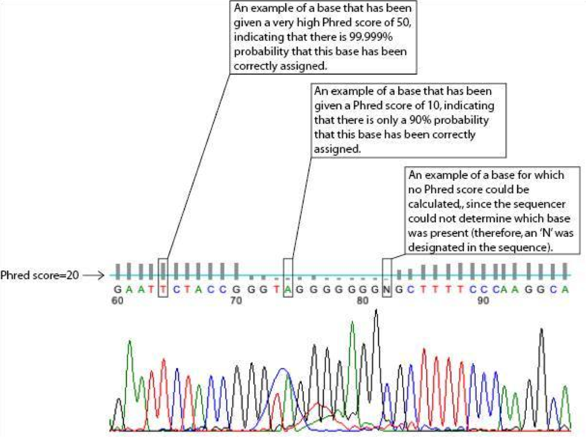

```{r, include=FALSE}
source("../bin/chunk-options.R")
knitr_fig_path("04-")
```


## Assessing sequence quality: phred scores


```{r, echo=FALSE, out.align="center", out.height=450}
knitr::include_graphics("../fig/01-phred.png")
```

### Ewing B, Green P. (1998): Base-calling of automated sequencer traces using phred. II. Error probabilities. Genome Res. 8(3):186-194.


## Assessing seqeunce quality: phred scores


```{r, echo=FALSE, out.align="center", out.height=300}
knitr::include_graphics("../fig/01-phred2.png")
```

Can use ASCII to represent quality scores by adding 33 to the phred score and converting to ASCII.
 - Quality score of 38 becomes 38+33=71: “G” 

[http://en.wikipedia.org/wiki/Phred_quality_score](http://en.wikipedia.org/wiki/Phred_quality_score)


 


```{r, echo=FALSE, out.align="center", out.height=600}
knitr::include_graphics("../fig/01-asciitable.png")
```


```{r, echo=FALSE, out.align="center", out.height=550}

```

[http://en.wikipedia.org/wiki/Phred_quality_score](http://en.wikipedia.org/wiki/Phred_quality_score)


## Sequence data format

 - The FASTQ format allows the storage of both sequence and quality information for each read.
 - This is a compact text-based format that has become the de facto standard for storing data from next generation sequencing experiments.


## Fastq format 


```{r, echo=FALSE, out.align="center", out.height=420}
knitr::include_graphics("../fig/01-fastq1.png")
```

### http://en.wikipedia.org/wiki/FASTQ_format

*** =right
 - Line 1: '@' character followed by sequence identifier and optional description.
 - Line 2: base calls.
 - Line 3: '+' character, ptionally followed by the same sequence identifier (and description) again.
 - Line 4: quality scores


## Fastq format


```{r, echo=FALSE, out.align="center", out.height=475}
knitr::include_graphics("../fig/01-fastq2.png")
```

### http://en.wikipedia.org/wiki/FASTQ_format


## Quality Assessment

 - The information in the FASTQ file can be used to assess the read quality.
 - A number of tools are available on the unix/linux command line, and/or within R for manipulating FASTQ data.


